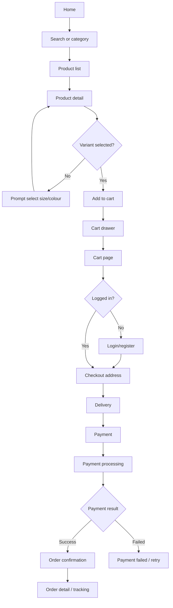
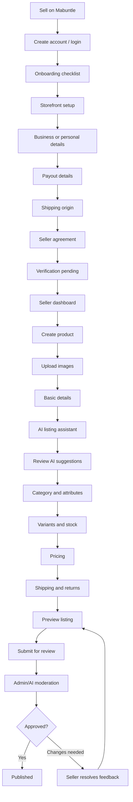
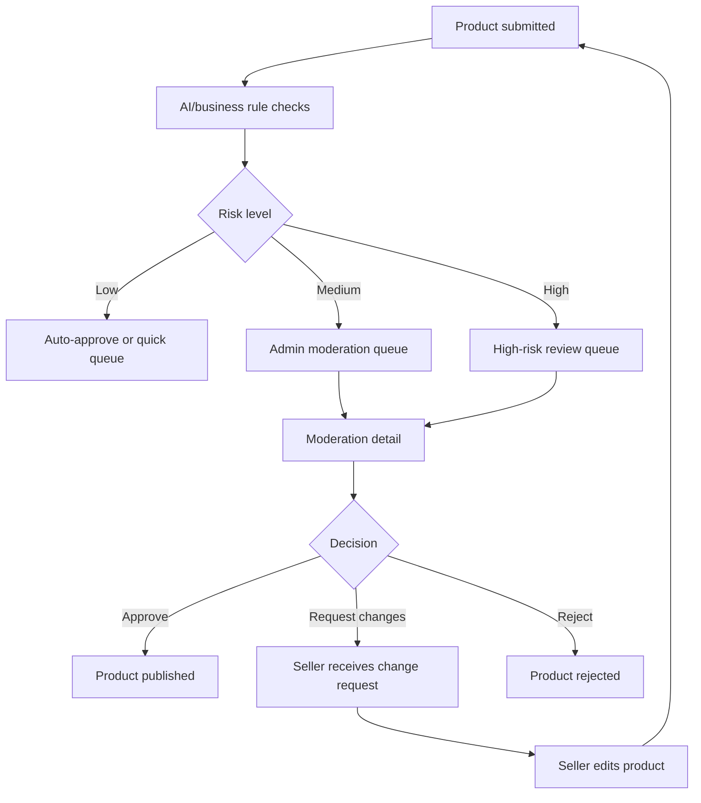
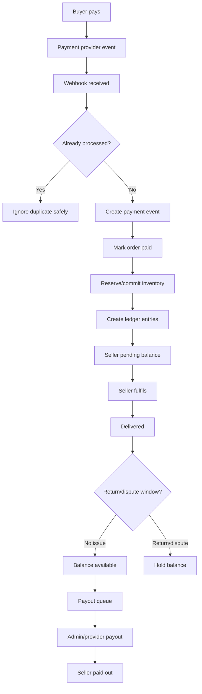

# Mabuntle Detailed UX Flow and Screen Inventory

**Platform:** Mabuntle  
**Product type:** Transactional ecommerce marketplace for fashion, clothing, jewellery, accessories, and beauty products  
**Primary roles:** Guest, Buyer, Seller, Admin, Support Agent, Super Admin  
**Design goal:** Crisp, seamless, fast, trustworthy, mobile-first buyer journeys with operationally strong seller/admin flows.  
**Companion files:** `mabuntle_screen_inventory.csv` contains a detailed inventory of 137 screens/states.

---

## 1. Purpose

This document turns the Mabuntle product plan into a detailed UX flow and screen inventory. It is intended for:

- Figma screen planning
- Angular routing and module planning
- Codex feature prompts
- Backend API planning
- Stakeholder alignment
- MVP scope control
- QA test-case derivation

The goal is to define **how every major feature should feel and flow**, not only which screens exist.

---

## 2. UX north star

Mabuntle should feel like a marketplace where a user can move from discovery to purchase, or from seller onboarding to product publishing, without feeling blocked by complexity.

The experience should be:

- **Fast:** users should reach product, checkout, or seller actions quickly.
- **Clear:** every screen should have one dominant primary action.
- **Trustworthy:** payment, delivery, returns, seller verification, and product status should be visible.
- **Fashion-forward:** visuals should prioritise product imagery, elegant spacing, and premium warm-neutral branding.
- **AI-assisted, not AI-dependent:** AI should speed up listing and product discovery but never make the core workflow impossible without AI.
- **Mobile-first for buyers:** shopping, searching, checkout, order tracking, and AI assistant flows must work beautifully on mobile.
- **Desktop-efficient for sellers/admins:** dashboards, tables, queues, moderation, and finance flows should be optimised for desktop but remain responsive.

---

## 3. Seamless interaction principles

### 3.1 One primary action per screen

Every screen should have a clear next step. Examples:

- Product detail: **Add to cart**
- Cart: **Proceed to checkout**
- Checkout address: **Continue to delivery**
- Seller product preview: **Submit for review**
- Admin moderation detail: **Approve**, **Request changes**, or **Reject**

Secondary actions should not compete visually with the primary action.

### 3.2 Progressive disclosure

Do not show every possible field at once. Split complex workflows into steps:

```txt
Product creation:
Images → Basics → Category/attributes → Variants/stock → Pricing → Shipping/returns → Preview → Submit
```

```txt
Checkout:
Cart → Address → Delivery → Payment → Confirmation
```

This keeps each step understandable and lowers abandonment.

### 3.3 Preserve context

Users should not lose their place. Use:

- Back links that return to filtered lists
- URL query params for filters
- Draft autosave for seller forms
- Sticky order/product status summaries
- Breadcrumbs for seller/admin flows
- Deep links from notifications to the exact object

### 3.4 Show status everywhere

Transactional marketplaces need visible states:

- Product: Draft, Pending Review, Published, Rejected, Out of Stock
- Order: Paid, Processing, Shipped, Delivered, Return Requested, Refunded
- Seller: Pending Verification, Verified, Suspended
- Payout: Pending, On Hold, Available, Paid Out
- Campaign: Draft, Pending Approval, Active, Paused, Ended, Rejected

Statuses should be consistent across buyer, seller, and admin interfaces.

### 3.5 Use inline validation and helpful empty states

Users should not reach the end of a flow before learning something is wrong. Use:

- Inline form errors
- Disabled CTA with explanation
- Step checklist
- Quality score for product listings
- “What to do next” empty states

### 3.6 AI should be transparent and editable

AI suggestions should be presented as drafts. Sellers should be able to accept fields individually.

```txt
AI suggests → Seller reviews → Seller edits/accepts → Backend validates → Product submitted
```

AI should never publish directly or invent product facts.

### 3.7 Mobile interaction rules

For mobile:

- Use sticky bottom CTAs for checkout, product detail, and seller wizard steps.
- Use drawers for filters, cart, and quick actions.
- Use cards instead of dense tables.
- Keep forms single-column.
- Avoid tiny tap targets.
- Use collapsible sections for long product detail pages.

### 3.8 Desktop interaction rules

For seller/admin desktop:

- Use side navigation.
- Use tables with filters and saved views.
- Use right-side detail panels for queue-based workflows where possible.
- Keep operational actions close to related data.
- Use audit-friendly confirmations for sensitive actions.

---

## 4. Information architecture

```txt
Mabuntle
├── Public / Buyer
│   ├── Home
│   ├── Shop
│   ├── Category pages
│   ├── Search results
│   ├── Product detail
│   ├── Seller storefront
│   ├── Wishlist
│   ├── Cart
│   ├── Checkout
│   ├── Orders
│   ├── Returns / disputes
│   ├── Buyer AI assistant
│   └── Visual search
│
├── Seller Portal
│   ├── Onboarding
│   ├── Dashboard
│   ├── Storefront settings
│   ├── Products
│   ├── AI listing assistant
│   ├── Inventory
│   ├── Orders
│   ├── Returns / disputes
│   ├── Finance / payouts
│   ├── Advertising campaigns
│   ├── Analytics
│   └── Support
│
├── Admin Portal
│   ├── Dashboard
│   ├── Seller approval
│   ├── Product moderation
│   ├── AI risk review
│   ├── Users
│   ├── Orders
│   ├── Payments / ledger
│   ├── Refunds / disputes
│   ├── Payouts
│   ├── Advertising approvals
│   ├── Support tickets
│   ├── Catalog management
│   ├── Analytics
│   └── System / audit / settings
│
└── Shared
    ├── Authentication
    ├── Notifications
    ├── Help centre
    ├── Empty states
    ├── Error states
    └── Confirmation / toast patterns
```

---

## 5. Global navigation model

### 5.1 Public buyer navigation

Desktop header:

```txt
Mabuntle logo | Search | Women | Men | Jewellery | Beauty | Accessories | Sell on Mabuntle | Wishlist | Cart | Account
```

Mobile header:

```txt
Top: Logo | Search icon | Cart
Bottom nav: Home | Shop | AI | Wishlist | Account
```

Recommended mobile bottom navigation:

```txt
Home
Shop
AI Assistant
Wishlist
Account
```

Cart can remain in the top-right because it is an important transactional action.

### 5.2 Seller navigation

Desktop sidebar:

```txt
Dashboard
Products
AI Assistant
Inventory
Orders
Returns
Finance
Ads
Analytics
Store Settings
Support
```

Mobile seller nav:

```txt
Dashboard
Products
Orders
Finance
More
```

The “More” menu contains ads, analytics, inventory, settings, and support.

### 5.3 Admin navigation

Desktop sidebar:

```txt
Dashboard
Seller Approvals
Product Moderation
Orders
Payments
Refunds & Disputes
Payouts
Users
Support Tickets
Ads
Catalog
Analytics
Audit Logs
Settings
```

Admin can be desktop-first. Mobile admin should be functional for urgent approvals but not the primary design target.

---

## 6. End-to-end journey maps

### 6.1 Guest to purchase journey



Seamless notes:

- Search remains visible from Home through product listings.
- Filters persist in the URL.
- Add-to-cart opens a drawer instead of navigating away immediately.
- Checkout uses a short stepper and sticky mobile CTA.
- Payment failure returns user to retry without losing cart context.

### 6.2 Seller onboarding to first published product



Seamless notes:

- Sellers can draft products while verification is pending.
- Sellers cannot publish/sell until required verification rules are satisfied.
- Product creation autosaves after each step.
- AI suggestions are optional and editable.
- Rejection/change requests deep-link to the exact product fields that need work.

### 6.3 Admin moderation journey



Seamless notes:

- Admin queue is sorted by risk and age.
- Admin decision requires a reason.
- Seller receives clear instructions, not vague rejection copy.
- Product preview in admin should match buyer view.

### 6.4 Payment, ledger, and payout journey



Seamless notes:

- Buyer sees order confirmation only when payment is confirmed or clearly pending.
- Seller finance screens explain pending, on-hold, and available funds.
- Admin can trace order → payment → ledger → payout.

---

## 7. Feature-level UX flows

Each feature below includes the ideal screen sequence, interaction design, states, and screen IDs from the inventory.

---

### 7.1 Authentication and account access

**Goal:** Let users access the correct buyer, seller, or admin area without losing their original intent.

**Screen sequence:**

```txt
Protected action or Login CTA
→ Login / Register
→ Email verification if required
→ Role-based redirect
→ Return to intended screen
```

**Buyer example:**

```txt
Product detail → Add to wishlist → Login → Wishlist action completes → Product detail
```

**Seller example:**

```txt
Sell on Mabuntle → Register → Verify email → Seller onboarding checklist
```

**Admin example:**

```txt
Admin login → MFA/security step → Admin dashboard
```

**Smooth interaction rules:**

- Keep redirect URL after login.
- Buyer registration should be short.
- Seller registration should transition into onboarding, not a generic account page.
- Password reset should not reveal whether an email exists.
- Admin login should be separate from public login.

**Screens:** A-001, A-002, A-003, A-004, AD-001.

---

### 7.2 Home, discovery, and category browsing

**Goal:** Help buyers quickly understand Mabuntle, search products, and enter relevant categories.

**Screen sequence:**

```txt
Home
→ Search, category, featured collection, or seller storefront
→ Product listing grid
→ Product detail
```

**Home content order:**

```txt
Hero with search/CTA
Category chips
New arrivals
Featured sellers
Beauty/jewellery/fashion sections
Trust strip: secure checkout, buyer protection, verified sellers
Seller CTA
```

**Smooth interaction rules:**

- Search should be visible immediately.
- Product imagery should dominate.
- Category cards should use clear fashion labels.
- Trust messaging should appear before checkout, not only at checkout.
- Mobile home should not be overloaded; use horizontal rails.

**Screens:** B-001, B-002, B-003.

---

### 7.3 Search, filters, and product discovery

**Goal:** Let buyers narrow fashion/beauty results with minimal friction.

**Screen sequence:**

```txt
Search/category page
→ Filter drawer/sidebar
→ Updated results
→ Product detail
→ Back returns to same filtered results
```

**Filter groups:**

```txt
Category
Size
Colour
Brand
Price
Material
Condition
Seller rating
Availability
Location/delivery
Beauty: skin type, shade, product type, ingredients flags
Jewellery: metal, stone, plating, hypoallergenic status
```

**Smooth interaction rules:**

- Desktop: left filter sidebar and top sort controls.
- Mobile: filter drawer with sticky Apply button and result count.
- Show active filter chips above results.
- No-results state should suggest removing filters or trying adjacent categories.
- Preserve all filters in URL.

**Screens:** B-002, B-003, B-004, B-005.

---

### 7.4 Product detail and product confidence

**Goal:** Help buyers confidently evaluate a product and add the correct variant to cart.

**Screen sequence:**

```txt
Product detail
→ Select size/colour/variant
→ Add to cart
→ Cart drawer
```

**Product detail layout:**

```txt
Image gallery
Title, price, rating
Variant selector
Stock/delivery estimate
Add to cart / wishlist
Seller card
Delivery and returns
Description
Attributes
Reviews
Similar products
```

**Smooth interaction rules:**

- Disable Add to cart until required variant is selected.
- Show size guide near size selection.
- If variant is out of stock, allow wishlist/back-in-stock alert later.
- Keep Add to cart sticky on mobile.
- Show seller verification and return policy near purchase area.

**Screens:** B-006, B-007, B-008, B-011.

---

### 7.5 Wishlist and saved discovery

**Goal:** Let buyers save products without interrupting browsing.

**Screen sequence:**

```txt
Product card/detail → Heart icon → Saved state
→ Wishlist page
→ Move to cart or open product
```

**Smooth interaction rules:**

- Guest wishlist can be local/session-based.
- Prompt login only when persisting or viewing full wishlist.
- Wishlist items should show availability and price changes.
- Move-to-cart should require variant selection if not already known.

**Screens:** B-009, B-010.

---

### 7.6 Cart and single-seller checkout preparation

**Goal:** Give buyers a simple, understandable cart while protecting MVP complexity.

**MVP rule:** One seller per checkout.

**Screen sequence:**

```txt
Add to cart
→ Cart drawer
→ Cart page
→ Checkout address
```

**Smooth interaction rules:**

- Add-to-cart opens cart drawer, not a full redirect.
- If buyer tries to add a product from another seller, show options:
  - Replace cart
  - Save current cart for later, if supported
  - Cancel
- Cart page should show seller grouping even if only one seller is allowed.
- Quantity updates should recalculate totals immediately.
- Stock changes should be clearly explained.

**Screens:** B-011, B-012.

---

### 7.7 Checkout and payment

**Goal:** Make payment feel secure, short, and recoverable if anything fails.

**Screen sequence:**

```txt
Cart
→ Address
→ Delivery
→ Payment
→ Processing
→ Success or failed retry
```

**Checkout step rules:**

```txt
Step 1: Address
Step 2: Delivery
Step 3: Payment
Step 4: Confirmation
```

**Smooth interaction rules:**

- Use a checkout stepper.
- Keep order summary visible on desktop and collapsible on mobile.
- Reserve stock during checkout for a limited time.
- Show payment security reassurance.
- Never lose cart data after payment failure.
- If payment confirmation is delayed, show “Payment pending” rather than false failure.

**Screens:** B-013, B-014, B-015, B-016, B-017, B-018, B-019.

---

### 7.8 Orders, tracking, and post-purchase confidence

**Goal:** Keep buyers informed after purchase and reduce support tickets.

**Screen sequence:**

```txt
Order confirmation
→ Order detail
→ Shipment tracking
→ Delivered
→ Review or return
```

**Order detail sections:**

```txt
Status timeline
Items
Seller information
Delivery address
Tracking details
Payment summary
Return/refund actions
Support link
```

**Smooth interaction rules:**

- Show next expected action based on order status.
- Buyer should always know whether seller or courier is the current dependency.
- Use notifications for status changes.
- Delivery delays should be visible.

**Screens:** B-020, B-021, B-022, B-023.

---

### 7.9 Returns, refunds, and disputes

**Goal:** Make returns understandable and controlled without creating operational chaos.

**Screen sequence:**

```txt
Order detail
→ Start return
→ Select item and reason
→ Add evidence if needed
→ Submit
→ Return status timeline
→ Seller response
→ Admin escalation if disputed
→ Refund result
```

**Return reasons:**

```txt
Wrong size
Wrong item
Damaged item
Not as described
Counterfeit concern
Expired beauty product
Changed mind
Late delivery
Other
```

**Smooth interaction rules:**

- Show return eligibility before the user fills the form.
- Ask for evidence only when relevant.
- Timeline should show who needs to act next.
- Rejection must include a reason and escalation option.
- Refund amount should be visible when known.

**Screens:** B-024, B-025, B-026, B-027, S-034, S-035, AD-020, AD-021, AD-022.

---

### 7.10 Buyer AI shopping/style assistant

**Goal:** Help buyers discover real products through natural language without inventing results.

**Screen sequence:**

```txt
AI assistant
→ Buyer asks request
→ AI extracts intent
→ Backend searches real products
→ AI groups and explains results
→ Buyer refines or opens product
→ Add to cart/wishlist
```

**Example prompts:**

```txt
I need an outfit for a wedding under R1,500.
Find gold earrings for sensitive ears.
Show me a black dress in size medium.
Find skincare for oily skin under R300.
```

**Smooth interaction rules:**

- Show suggestion chips to reduce typing.
- Always display product cards with price, stock, and seller.
- AI responses must be grounded in real product results.
- Let users refine by budget, size, colour, category, and occasion.
- If no results, suggest similar alternatives rather than hallucinating.

**Screens:** B-034, B-035.

---

### 7.11 Visual search

**Goal:** Let buyers upload inspiration images and find visually similar products.

**Screen sequence:**

```txt
Visual search upload
→ AI detects product/category/colour/style
→ User can edit detected attributes
→ Results page
→ Product detail
```

**Smooth interaction rules:**

- Show example images before upload.
- Explain that results are based on available Mabuntle products.
- Let user edit detected category/colour/style.
- Display “similar but not exact” language.

**Screens:** B-036, B-037.

---

### 7.12 Seller onboarding and verification

**Goal:** Get sellers from interest to a usable seller dashboard with clear verification expectations.

**Screen sequence:**

```txt
Sell on Mabuntle
→ Seller registration/login
→ Onboarding checklist
→ Storefront setup
→ Business/personal details
→ Payout details
→ Shipping origin/return address
→ Seller agreement
→ Verification pending
→ Dashboard
```

**Smooth interaction rules:**

- Explain seller benefits and fees upfront.
- Show progress across onboarding steps.
- Allow sellers to save and return later.
- Let pending sellers draft products but restrict publishing/selling if required.
- Rejection should be specific and fixable.

**Screens:** S-001 to S-009.

---

### 7.13 Seller dashboard

**Goal:** Give sellers a simple command centre for urgent tasks.

**Dashboard content:**

```txt
Verification status
Product quality tasks
New orders
Low stock alerts
Pending returns
Pending payout summary
AI listing assistant CTA
Recent campaign metrics later
```

**Smooth interaction rules:**

- Dashboard should answer: “What needs my attention today?”
- Use task cards with direct CTAs.
- Do not overload early sellers with empty analytics.
- Pending verification should be highly visible.

**Screens:** S-010, S-011, S-050, S-051.

---

### 7.14 Product creation wizard

**Goal:** Let sellers create proper ecommerce products without feeling overwhelmed.

**Screen sequence:**

```txt
Products list
→ Create product
→ Upload images
→ Basic details
→ AI assistant optional
→ Category and attributes
→ Variants and stock
→ Pricing
→ Shipping and returns
→ Preview
→ Submit for review
→ Product status detail
```

**Smooth interaction rules:**

- Autosave product draft after each step.
- Show completion checklist.
- Let seller jump between completed steps.
- Use dynamic category attributes.
- Display seller earnings estimate during pricing.
- Preview should exactly match buyer-facing product detail.

**Screens:** S-012 to S-021.

---

### 7.15 AI Fashion Product Listing Assistant

**Goal:** Help sellers create better product data faster.

**Screen sequence:**

```txt
Product draft with images/notes
→ AI assistant panel
→ Generate suggestions
→ Image/text analysis
→ Suggest title, description, category, attributes, tags
→ Seller reviews field-by-field
→ Missing fields checklist
→ Risk warnings if needed
→ Apply to product draft
→ Backend validation
```

**AI output groups:**

```txt
Title suggestions
Short description
Full description
Suggested category
Suggested attributes
Style tags
Occasion tags
SEO keywords
Image alt text
Missing fields
Risk flags
Quality score
```

**Smooth interaction rules:**

- AI generation should be optional.
- AI output should be structured and editable.
- Seller should accept fields individually.
- Missing fields should deep-link to exact form controls.
- Risk warnings should use neutral, helpful wording.
- AI should never invent brand, material, authenticity, ingredients, medical claims, expiry date, or stock.

**Screens:** S-022 to S-026.

---

### 7.16 Inventory and stock management

**Goal:** Help sellers avoid overselling and manage variants clearly.

**Screen sequence:**

```txt
Inventory overview
→ Filter low stock / out of stock / reserved
→ Open adjustment
→ Enter new stock or adjustment
→ Save with reason
→ Inventory overview updates
```

**Smooth interaction rules:**

- Separate available, reserved, sold, and returned stock.
- Low-stock warnings should be actionable.
- Stock adjustments require a reason for audit.
- Variant labels must be clear: size, colour, SKU.

**Screens:** S-028, S-029.

---

### 7.17 Seller order fulfilment

**Goal:** Help sellers process orders accurately and quickly.

**Screen sequence:**

```txt
Seller orders list
→ Order detail
→ Fulfil order checklist
→ Upload tracking
→ Buyer notified
→ Order status updates
```

**Smooth interaction rules:**

- Orders list should use status tabs.
- Order detail should show item variants clearly.
- Fulfilment checklist reduces packing mistakes.
- Upload tracking should trigger buyer notification.
- Payout impact should be visible but not distracting.

**Screens:** S-030 to S-033.

---

### 7.18 Seller finance, balances, and payouts

**Goal:** Make seller money movement transparent.

**Screen sequence:**

```txt
Seller finance overview
→ See pending/on-hold/available balance
→ View ledger/order breakdown
→ Request payout or await scheduled payout
→ View payout history
→ Update payout settings with security checks
```

**Smooth interaction rules:**

- Use plain language: Pending, On hold, Available, Paid out.
- Explain why funds are on hold.
- Link balances to orders.
- Bank changes require extra confirmation.
- Sellers should never have to guess how payout was calculated.

**Screens:** S-037, S-038, S-039.

---

### 7.19 Seller advertising campaigns

**Goal:** Let sellers promote products transparently once platform traffic exists.

**Screen sequence:**

```txt
Ad dashboard
→ Create campaign
→ Choose campaign type
→ Select eligible products
→ Choose placement/targeting
→ Set budget and schedule
→ Review sponsored preview
→ Submit for approval
→ Campaign detail
→ Campaign analytics
```

**Smooth interaction rules:**

- Show eligibility before sellers configure campaign.
- Disable ineligible products with explanation.
- Show max spend and schedule clearly.
- Label promoted placements as Sponsored.
- Campaign analytics should show impressions, clicks, spend, sales, and return on ad spend.

**Screens:** S-042 to S-049, AD-028, AD-029.

---

### 7.20 Seller analytics

**Goal:** Help sellers improve listings and sales.

**Screen sequence:**

```txt
Analytics overview
→ Product performance detail
→ Suggested action: improve listing, restock, or promote
```

**Smooth interaction rules:**

- Do not show analytics too early if there is no data.
- Make insights actionable.
- Connect weak product performance to AI listing improvement or campaign creation.

**Screens:** S-040, S-041.

---

### 7.21 Admin seller approval and seller risk

**Goal:** Protect the marketplace while onboarding sellers efficiently.

**Screen sequence:**

```txt
Admin dashboard
→ Seller approval queue
→ Seller verification detail
→ Approve, reject, or request more info
→ Seller notified
→ Seller risk profile available after activity
```

**Smooth interaction rules:**

- Queue sorted by pending age and risk.
- Admin decisions require a reason.
- Rejection/request-more-info should use templates plus custom notes.
- Risk profile should combine seller history, disputes, rejected products, refund rate, and payout changes.

**Screens:** AD-002, AD-003, AD-004, AD-005, AD-015.

---

### 7.22 Admin product moderation and AI risk review

**Goal:** Ensure products are safe, accurate, and policy-compliant before publishing.

**Screen sequence:**

```txt
Product submitted
→ AI/business rule scan
→ Moderation queue
→ Product moderation detail
→ AI risk review if flagged
→ Approve / request changes / reject
→ Seller notified
```

**Smooth interaction rules:**

- Product detail should show buyer preview and admin-only risk data.
- Risk flags should include exact phrase/image reason.
- Admin can mark false positive.
- Seller change requests should deep-link to relevant product fields.

**Screens:** AD-006, AD-007, AD-008, AD-009.

---

### 7.23 Admin orders, payments, ledger, refunds, and payouts

**Goal:** Give operations and finance teams traceability across the full transaction lifecycle.

**Screen sequence:**

```txt
Order dashboard
→ Order detail
→ Payment events / ledger detail
→ Refund or dispute if needed
→ Payout queue
→ Payout detail
→ Release, hold, or fail payout
```

**Smooth interaction rules:**

- Every order should link to payment, ledger, shipment, return, dispute, and payout records.
- Duplicate webhooks should be visible but safely ignored.
- Payout actions require confirmation and reason.
- Ledger should clearly show platform commission, payment fee, seller balance, refunds, and payout.

**Screens:** AD-016 to AD-025, AD-031.

---

### 7.24 Admin support tickets

**Goal:** Help support agents resolve buyer/seller issues quickly with context.

**Screen sequence:**

```txt
Support inbox
→ Ticket detail
→ View linked order/product/user context
→ Public reply or internal note
→ Escalate or resolve
```

**Smooth interaction rules:**

- Internal notes must be visually distinct from public replies.
- Tickets should link to the related order/product/seller/buyer.
- Support actions should be audited.
- Escalations should move to dispute/admin queue when needed.

**Screens:** AD-026, AD-027, B-032, S-036.

---

### 7.25 Admin catalog management

**Goal:** Control categories and attributes that power product creation, search filters, AI suggestions, and moderation.

**Screen sequence:**

```txt
Category management
→ Category detail
→ Attribute builder
→ Brand management
→ Product creation/search forms update
```

**Smooth interaction rules:**

- Category attributes define required seller fields.
- Avoid deleting categories with active products; archive instead.
- Attribute changes should warn if they affect published products.
- Luxury/branded categories can trigger additional proof requirements.

**Screens:** AD-010, AD-011, AD-012.

---

### 7.26 Notifications

**Goal:** Keep users informed and route them directly to relevant actions.

**Notification types:**

```txt
Buyer:
Order paid, shipped, delivered, return update, refund update, support reply

Seller:
Verification update, product approved/rejected, new order, return request, payout update, campaign update

Admin/support:
New seller approval, high-risk product, failed webhook, dispute escalation, payout review
```

**Smooth interaction rules:**

- Notifications deep-link to exact object.
- Separate urgent operational notifications from general updates.
- Include unread counts.
- Email/in-app notification content should match the UI status text.

**Screens:** B-031, S-051, AD-035.

---

### 7.27 Shared loading, empty, error, and permission states

**Goal:** Make the platform feel polished even when data is loading, missing, or unavailable.

**State rules:**

```txt
Loading:
Use skeletons for product grids, dashboards, and tables.

Empty:
Explain why empty and provide one useful next action.

Error:
Explain the issue, offer retry, and provide support path if serious.

Permission denied:
Explain that the current role cannot access the page.

Confirmation:
Use for destructive or financial actions.
```

**Screens:** C-001 to C-007.

---

## 8. MVP screen priorities

### 8.1 Must-have MVP screens

```txt
Home
Shop/category/search
Product detail
Seller storefront
Wishlist
Cart
Checkout
Payment success/failure
Buyer orders
Order detail
Return request
Login/register/email verification
Seller onboarding
Seller dashboard
Product creation wizard
AI Listing Assistant MVP
Inventory overview
Seller orders
Seller finance
Admin dashboard
Seller approval
Product moderation
Orders/payment/refund/payout admin screens
Support tickets
Common states
```

### 8.2 Later-phase screens

```txt
Buyer AI shopping assistant
Visual search
Recently viewed
Stored payment methods
Bulk product import
Seller analytics
Seller ad campaigns
Admin AI cost dashboard
Policy rules engine
Advanced reports
Notification templates
System health dashboard
```

---

## 9. Angular route/module planning

Recommended Angular feature modules or standalone route groups:

```txt
app/
├── public/
│   ├── home
│   ├── shop
│   ├── search
│   ├── product-detail
│   ├── seller-storefront
│   └── help
│
├── auth/
│   ├── login
│   ├── register
│   ├── forgot-password
│   └── verify-email
│
├── buyer/
│   ├── account
│   ├── wishlist
│   ├── orders
│   ├── returns
│   ├── support
│   ├── ai-assistant
│   └── visual-search
│
├── cart-checkout/
│   ├── cart
│   ├── address
│   ├── delivery
│   ├── payment
│   └── confirmation
│
├── seller/
│   ├── onboarding
│   ├── dashboard
│   ├── products
│   ├── ai-listing-assistant
│   ├── inventory
│   ├── orders
│   ├── returns
│   ├── finance
│   ├── ads
│   ├── analytics
│   ├── settings
│   └── support
│
├── admin/
│   ├── dashboard
│   ├── sellers
│   ├── products-moderation
│   ├── users
│   ├── orders
│   ├── payments
│   ├── refunds-disputes
│   ├── payouts
│   ├── ads
│   ├── catalog
│   ├── support
│   ├── reports
│   ├── audit
│   └── settings
│
└── shared/
    ├── components
    ├── layout
    ├── guards
    ├── interceptors
    ├── pipes
    └── design-system
```

---

## 10. Shared component inventory

### Buyer components

```txt
ProductCard
ProductGrid
ProductImageGallery
CategoryCard
SearchBar
FilterDrawer
FilterSidebar
SortDropdown
WishlistButton
SellerBadge
RatingSummary
CartDrawer
CheckoutStepper
OrderTimeline
ReturnStatusTimeline
```

### Seller components

```txt
SellerSidebar
SellerTaskCard
ProductStatusBadge
ProductWizardStepper
ImageUploader
VariantMatrix
AttributeEditor
AiSuggestionPanel
ListingQualityScore
InventoryAdjustmentModal
OrderFulfilmentChecklist
SellerBalanceCard
CampaignMetricCard
```

### Admin components

```txt
AdminSidebar
AdminQueueTable
RiskBadge
ModerationReviewPanel
DecisionComposer
AuditLogTable
LedgerEntryTable
PayoutActionPanel
SupportThread
InternalNote
SlaBadge
```

### Shared UI components

```txt
Button
Card
Badge
Toast
Modal
Drawer
Stepper
FormField
DatePicker
Tabs
DataTable
Skeleton
EmptyState
ErrorState
ConfirmationDialog
```

---

## 11. Screen inventory summary

The full CSV contains 137 screens/states with routes, roles, priority, orientation, entry points, CTAs, states, components, and UX notes.

Below is a compact screen list grouped by module and feature.

### Public / Buyer — Home & discovery
| ID | Screen | Route | Priority | Main CTA | States |
|---|---|---|---|---|---|
| B-001 | Home / discovery | `/` | MVP | Shop now | Loading hero, empty featured, personalization unavailable |
| B-002 | Shop index | `/shop` | MVP | Apply filter or open product | Skeleton grid, no products, filter loading |

### Public / Buyer — Category browsing
| ID | Screen | Route | Priority | Main CTA | States |
|---|---|---|---|---|---|
| B-003 | Category landing | `/shop/:categorySlug` | MVP | Filter products | Empty category, subcategory loading |

### Public / Buyer — Search
| ID | Screen | Route | Priority | Main CTA | States |
|---|---|---|---|---|---|
| B-004 | Search results | `/search?q=` | MVP | Open product | No results, typo suggestion, loading |
| B-005 | Filter drawer / filter sidebar | `/search?filters=` | MVP | Apply filters | No matching filters, loading counts |

### Public / Buyer — Product shopping
| ID | Screen | Route | Priority | Main CTA | States |
|---|---|---|---|---|---|
| B-006 | Product detail | `/product/:productSlug` | MVP | Add to cart | Out of stock, variant unavailable, seller unavailable |
| B-007 | Product image gallery modal | `/product/:productSlug?gallery=1` | MVP | Close gallery | Image loading, broken image |

### Public / Buyer — Seller storefront
| ID | Screen | Route | Priority | Main CTA | States |
|---|---|---|---|---|---|
| B-008 | Public seller storefront | `/store/:storeSlug` | MVP | Follow seller / Shop products | No products, seller suspended |

### Public / Buyer — Wishlist
| ID | Screen | Route | Priority | Main CTA | States |
|---|---|---|---|---|---|
| B-009 | Wishlist | `/account/wishlist` | MVP | Move to cart | Empty wishlist, product unavailable |

### Public / Buyer — Recently viewed
| ID | Screen | Route | Priority | Main CTA | States |
|---|---|---|---|---|---|
| B-010 | Recently viewed | `/account/recently-viewed` | Later | Open product | Empty recently viewed |

### Public / Buyer — Cart
| ID | Screen | Route | Priority | Main CTA | States |
|---|---|---|---|---|---|
| B-011 | Cart drawer | `/cart?drawer=true` | MVP | Checkout | Empty cart, item removed, price changed |
| B-012 | Cart page | `/cart` | MVP | Proceed to checkout | Empty cart, stock changed, single-seller restriction |

### Public / Buyer — Checkout
| ID | Screen | Route | Priority | Main CTA | States |
|---|---|---|---|---|---|
| B-013 | Checkout: address | `/checkout/address` | MVP | Continue to delivery | No address, invalid address, save failed |
| B-014 | Checkout: delivery | `/checkout/delivery` | MVP | Continue to payment | No delivery option, seller shipping issue |
| B-015 | Checkout: payment | `/checkout/payment` | MVP | Pay securely | Payment method unavailable, validation error |
| B-016 | Checkout: review | `/checkout/review` | MVP | Place order / Pay | Price changed, stock reservation expired |
| B-017 | Payment processing | `/checkout/processing` | MVP | View order when confirmed | Timeout, redirect failed, webhook pending |
| B-018 | Payment success / order confirmation | `/checkout/success/:orderId` | MVP | Track order | Webhook pending, email resend failed |
| B-019 | Payment failed / retry | `/checkout/failed` | MVP | Retry payment | Payment expired, stock released |

### Public / Buyer — Orders
| ID | Screen | Route | Priority | Main CTA | States |
|---|---|---|---|---|---|
| B-020 | Buyer order list | `/account/orders` | MVP | Open order | No orders, loading |
| B-021 | Buyer order detail | `/account/orders/:orderId` | MVP | Track / request return / review | Shipment not available, return window closed |
| B-022 | Shipment tracking detail | `/account/orders/:orderId/tracking` | MVP | Contact support | Tracking unavailable, delayed shipment |

### Public / Buyer — Reviews
| ID | Screen | Route | Priority | Main CTA | States |
|---|---|---|---|---|---|
| B-023 | Leave product/seller review | `/account/orders/:orderId/review` | MVP | Submit review | Review already submitted, moderation warning |

### Public / Buyer — Returns & disputes
| ID | Screen | Route | Priority | Main CTA | States |
|---|---|---|---|---|---|
| B-024 | Start return request | `/account/orders/:orderId/return` | MVP | Start return | Return window closed, item not eligible |
| B-025 | Return reason and evidence | `/account/orders/:orderId/return/reason` | MVP | Submit return | Missing reason, upload failed |
| B-026 | Return/refund status | `/account/returns/:returnId` | MVP | View order / contact support | Seller response pending, rejected, refunded |
| B-027 | Dispute detail | `/account/disputes/:disputeId` | MVP | Send message / upload evidence | Closed dispute, missing evidence |

### Public / Buyer — Account
| ID | Screen | Route | Priority | Main CTA | States |
|---|---|---|---|---|---|
| B-028 | Buyer profile | `/account/profile` | MVP | Save profile | Validation, save failed |
| B-029 | Saved addresses | `/account/addresses` | MVP | Add address | No addresses, invalid address |
| B-030 | Payment methods placeholder | `/account/payment-methods` | Later | Add payment method | Provider unavailable |

### Public / Buyer — Notifications
| ID | Screen | Route | Priority | Main CTA | States |
|---|---|---|---|---|---|
| B-031 | Notification centre | `/account/notifications` | MVP | Open related item | No notifications |

### Public / Buyer — Support
| ID | Screen | Route | Priority | Main CTA | States |
|---|---|---|---|---|---|
| B-032 | Support tickets | `/account/support` | MVP | Create ticket | No tickets |
| B-033 | Help centre | `/help` | MVP | Search help | No article found |

### Public / Buyer — Buyer AI
| ID | Screen | Route | Priority | Main CTA | States |
|---|---|---|---|---|---|
| B-034 | AI shopping/style assistant | `/ai-assistant` | Later | Ask AI | No products, AI unavailable |
| B-035 | AI refined recommendations | `/ai-assistant/results` | Later | Refine / add to cart | No match, budget too low |

### Public / Buyer — Visual search
| ID | Screen | Route | Priority | Main CTA | States |
|---|---|---|---|---|---|
| B-036 | Visual search upload | `/visual-search` | Later | Upload image | Upload failed, unsupported file |
| B-037 | Visual search results | `/visual-search/results` | Later | Open product / refine | No similar products |

### Auth — Authentication
| ID | Screen | Route | Priority | Main CTA | States |
|---|---|---|---|---|---|
| A-001 | Login | `/auth/login` | MVP | Login | Invalid login, locked account |
| A-002 | Register buyer | `/auth/register` | MVP | Create account | Email exists, weak password |
| A-003 | Forgot password | `/auth/forgot-password` | MVP | Send reset link | Email not found generic state |
| A-004 | Email verification | `/auth/verify-email` | MVP | Continue | Expired token, resend |

### Seller — Seller onboarding
| ID | Screen | Route | Priority | Main CTA | States |
|---|---|---|---|---|---|
| S-001 | Seller registration choice | `/sell` | MVP | Start selling | Already seller |
| S-002 | Onboarding welcome checklist | `/seller/onboarding` | MVP | Continue | Incomplete checklist |
| S-003 | Storefront setup | `/seller/onboarding/storefront` | MVP | Save and continue | Store name taken, missing image |
| S-004 | Business/personal details | `/seller/onboarding/details` | MVP | Save and continue | Validation, document upload fail |
| S-005 | Payout details | `/seller/onboarding/payout` | MVP | Save and continue | Bank validation failed |
| S-006 | Shipping origin and return address | `/seller/onboarding/shipping` | MVP | Save and continue | Invalid address |
| S-007 | Seller agreement | `/seller/onboarding/agreement` | MVP | Submit for review | Agreement not accepted |
| S-008 | Verification pending | `/seller/onboarding/pending` | MVP | Go to dashboard | Rejected, needs more info |
| S-009 | Verification result | `/seller/onboarding/result` | MVP | Fix issues / Go to dashboard | Rejected, resubmit needed |

### Seller — Seller dashboard
| ID | Screen | Route | Priority | Main CTA | States |
|---|---|---|---|---|---|
| S-010 | Seller dashboard overview | `/seller/dashboard` | MVP | Create product | No products, pending verification |

### Seller — Seller storefront
| ID | Screen | Route | Priority | Main CTA | States |
|---|---|---|---|---|---|
| S-011 | Storefront preview | `/seller/storefront/preview` | MVP | Edit storefront | Missing banner/logo |

### Seller — Product management
| ID | Screen | Route | Priority | Main CTA | States |
|---|---|---|---|---|---|
| S-012 | Seller products list | `/seller/products` | MVP | Create product | No products, filters empty |
| S-021 | Product status/detail | `/seller/products/:id` | MVP | Edit / resolve issue | Rejected, changes requested, archived |
| S-027 | Bulk product import | `/seller/products/import` | Later | Upload CSV | CSV invalid, mapping errors |

### Seller — Product creation
| ID | Screen | Route | Priority | Main CTA | States |
|---|---|---|---|---|---|
| S-013 | Product draft: upload images | `/seller/products/new/images` | MVP | Continue | Upload failed, invalid image |
| S-014 | Product draft: basic details | `/seller/products/:id/basics` | MVP | Continue / Generate with AI | Title missing, text limits |
| S-015 | Product draft: category and attributes | `/seller/products/:id/category` | MVP | Continue | Invalid category, missing required attrs |
| S-016 | Product draft: variants and stock | `/seller/products/:id/variants` | MVP | Continue | No variants, negative stock |
| S-017 | Product draft: pricing | `/seller/products/:id/pricing` | MVP | Continue | Invalid price, fee preview error |
| S-018 | Product draft: shipping and returns | `/seller/products/:id/shipping` | MVP | Continue | Policy conflict, missing weight/dimensions |
| S-019 | Product draft: preview listing | `/seller/products/:id/preview` | MVP | Submit for review | Missing fields, moderation warning |
| S-020 | Product submitted confirmation | `/seller/products/:id/submitted` | MVP | View status | Submission failed |

### Seller — AI Listing Assistant
| ID | Screen | Route | Priority | Main CTA | States |
|---|---|---|---|---|---|
| S-022 | AI assistant panel entry | `/seller/products/:id/ai` | MVP | Generate suggestions | Insufficient input, AI unavailable |
| S-023 | AI image analysis state | `/seller/products/:id/ai/analyzing` | MVP | Review suggestions | Image analysis failed |
| S-024 | AI suggestion review | `/seller/products/:id/ai/suggestions` | MVP | Apply selected suggestions | Invalid JSON handled server-side, low confidence category |
| S-025 | AI missing fields checklist | `/seller/products/:id/ai/missing-fields` | MVP | Resolve fields | Optional fields, required fields |
| S-026 | AI risk warning review | `/seller/products/:id/ai/risk` | MVP | Edit product / acknowledge | High-risk blocked |

### Seller — Inventory
| ID | Screen | Route | Priority | Main CTA | States |
|---|---|---|---|---|---|
| S-028 | Inventory overview | `/seller/inventory` | MVP | Adjust stock | Low stock, no variants |
| S-029 | Inventory adjustment modal | `/seller/inventory/:variantId/adjust` | MVP | Save adjustment | Negative stock, reason missing |

### Seller — Order management
| ID | Screen | Route | Priority | Main CTA | States |
|---|---|---|---|---|---|
| S-030 | Seller orders list | `/seller/orders` | MVP | Open order | No orders, filter empty |
| S-031 | Seller order detail | `/seller/orders/:orderId` | MVP | Prepare order / upload tracking | Cancelled, disputed |
| S-032 | Fulfil order checklist | `/seller/orders/:orderId/fulfil` | MVP | Mark ready / shipped | Missing item, cancellation request |
| S-033 | Upload tracking | `/seller/orders/:orderId/tracking` | MVP | Save tracking | Invalid tracking, courier missing |

### Seller — Returns & disputes
| ID | Screen | Route | Priority | Main CTA | States |
|---|---|---|---|---|---|
| S-034 | Seller return request detail | `/seller/returns/:returnId` | MVP | Accept / dispute / message buyer | Deadline expired, escalated |
| S-035 | Refund proposal / settlement | `/seller/returns/:returnId/refund` | MVP | Accept refund / propose partial | Invalid amount, admin approval required |

### Seller — Support
| ID | Screen | Route | Priority | Main CTA | States |
|---|---|---|---|---|---|
| S-036 | Seller support/messages | `/seller/support` | MVP | Create ticket | No tickets |

### Seller — Finance
| ID | Screen | Route | Priority | Main CTA | States |
|---|---|---|---|---|---|
| S-037 | Seller balance | `/seller/finance/balance` | MVP | Request payout | No balance, on hold |
| S-038 | Payout history | `/seller/finance/payouts` | MVP | View payout | No payouts |
| S-039 | Payout settings | `/seller/finance/settings` | MVP | Save changes | Verification required, locked during review |

### Seller — Analytics
| ID | Screen | Route | Priority | Main CTA | States |
|---|---|---|---|---|---|
| S-040 | Seller analytics overview | `/seller/analytics` | Later | View product performance | No data |
| S-041 | Product performance detail | `/seller/analytics/products/:productId` | Later | Improve listing / promote | No data |

### Seller — Advertising
| ID | Screen | Route | Priority | Main CTA | States |
|---|---|---|---|---|---|
| S-042 | Ad campaign dashboard | `/seller/ads` | Later | Create campaign | No campaigns, not eligible |
| S-043 | Create campaign: choose type | `/seller/ads/new/type` | Later | Continue | Not eligible |
| S-044 | Create campaign: select products | `/seller/ads/new/products` | Later | Continue | No eligible products |
| S-045 | Create campaign: targeting and placement | `/seller/ads/new/targeting` | Later | Continue | Invalid placement |
| S-046 | Create campaign: budget and schedule | `/seller/ads/new/budget` | Later | Continue | Budget too low, date invalid |
| S-047 | Create campaign: review and submit | `/seller/ads/new/review` | Later | Submit campaign | Submission failed |
| S-048 | Campaign status/detail | `/seller/ads/:campaignId` | Later | Pause / edit / view analytics | Pending approval, rejected, paused |
| S-049 | Campaign analytics | `/seller/ads/:campaignId/analytics` | Later | Optimise campaign | No impressions, tracking delay |

### Seller — Settings
| ID | Screen | Route | Priority | Main CTA | States |
|---|---|---|---|---|---|
| S-050 | Store settings | `/seller/settings/store` | MVP | Save changes | Slug conflict, upload fail |

### Seller — Notifications
| ID | Screen | Route | Priority | Main CTA | States |
|---|---|---|---|---|---|
| S-051 | Seller notifications | `/seller/notifications` | MVP | Open related item | No notifications |

### Seller — Help
| ID | Screen | Route | Priority | Main CTA | States |
|---|---|---|---|---|---|
| S-052 | Seller help centre | `/seller/help` | MVP | Search help | No article |

### Admin — Admin auth
| ID | Screen | Route | Priority | Main CTA | States |
|---|---|---|---|---|---|
| AD-001 | Admin login | `/admin/login` | MVP | Login | MFA required, invalid credentials |

### Admin — Dashboard
| ID | Screen | Route | Priority | Main CTA | States |
|---|---|---|---|---|---|
| AD-002 | Admin dashboard overview | `/admin` | MVP | Open queue | No data, data loading |

### Admin — Seller approval
| ID | Screen | Route | Priority | Main CTA | States |
|---|---|---|---|---|---|
| AD-003 | Seller approval queue | `/admin/sellers/approvals` | MVP | Review seller | No pending sellers |
| AD-004 | Seller verification detail | `/admin/sellers/:sellerId/verification` | MVP | Approve / reject / request info | Missing docs, suspicious info |

### Admin — Seller risk
| ID | Screen | Route | Priority | Main CTA | States |
|---|---|---|---|---|---|
| AD-005 | Seller risk profile | `/admin/sellers/:sellerId/risk` | MVP | Suspend / hold payouts | Insufficient data |

### Admin — Product moderation
| ID | Screen | Route | Priority | Main CTA | States |
|---|---|---|---|---|---|
| AD-006 | Product moderation queue | `/admin/products/moderation` | MVP | Review product | No pending products |
| AD-007 | Product moderation detail | `/admin/products/:productId/moderation` | MVP | Approve / reject / request changes | Image unavailable, seller suspended |
| AD-009 | Request changes/rejection composer | `/admin/products/:productId/reject` | MVP | Send decision | Missing reason |

### Admin — AI moderation
| ID | Screen | Route | Priority | Main CTA | States |
|---|---|---|---|---|---|
| AD-008 | AI risk review | `/admin/ai-risk/:reviewId` | MVP | Resolve risk | False positive, escalation |

### Admin — Catalog management
| ID | Screen | Route | Priority | Main CTA | States |
|---|---|---|---|---|---|
| AD-010 | Category management | `/admin/catalog/categories` | MVP | Add/edit category | No categories |
| AD-011 | Category attribute builder | `/admin/catalog/categories/:id/attributes` | MVP | Save attributes | Validation conflict |
| AD-012 | Brand management | `/admin/catalog/brands` | MVP | Add brand | Duplicate brand |

### Admin — Users
| ID | Screen | Route | Priority | Main CTA | States |
|---|---|---|---|---|---|
| AD-013 | User management | `/admin/users` | MVP | Open user | No matches |
| AD-014 | Buyer admin profile | `/admin/buyers/:buyerId` | MVP | View orders/support | Privacy restricted |
| AD-015 | Seller admin profile | `/admin/sellers/:sellerId` | MVP | Review seller | Suspended seller |

### Admin — Orders
| ID | Screen | Route | Priority | Main CTA | States |
|---|---|---|---|---|---|
| AD-016 | Admin orders dashboard | `/admin/orders` | MVP | Open order | No orders |
| AD-017 | Admin order detail | `/admin/orders/:orderId` | MVP | Take action / open payment | Restricted action |

### Admin — Payments
| ID | Screen | Route | Priority | Main CTA | States |
|---|---|---|---|---|---|
| AD-018 | Payment events | `/admin/payments/events` | MVP | Open event | Duplicate webhook, failed webhook |

### Admin — Finance
| ID | Screen | Route | Priority | Main CTA | States |
|---|---|---|---|---|---|
| AD-019 | Ledger detail | `/admin/finance/ledger/:ledgerGroupId` | MVP | Export / audit | Unbalanced ledger |
| AD-025 | Seller balance adjustment | `/admin/sellers/:sellerId/balance-adjustment` | Later | Submit adjustment | Invalid amount, approval required |
| AD-031 | Revenue reports | `/admin/reports/revenue` | Later | Export report | Date range empty |

### Admin — Refunds
| ID | Screen | Route | Priority | Main CTA | States |
|---|---|---|---|---|---|
| AD-020 | Refund queue | `/admin/refunds` | MVP | Review refund | No refunds |

### Admin — Disputes
| ID | Screen | Route | Priority | Main CTA | States |
|---|---|---|---|---|---|
| AD-021 | Return/dispute queue | `/admin/disputes` | MVP | Review dispute | No disputes |
| AD-022 | Dispute detail | `/admin/disputes/:disputeId` | MVP | Resolve / request evidence | Insufficient evidence, appealed |

### Admin — Payouts
| ID | Screen | Route | Priority | Main CTA | States |
|---|---|---|---|---|---|
| AD-023 | Payout queue | `/admin/payouts` | MVP | Review payout | No payouts, failed payout |
| AD-024 | Payout detail / release / hold | `/admin/payouts/:payoutId` | MVP | Release / hold / fail | Balance mismatch |

### Admin — Support
| ID | Screen | Route | Priority | Main CTA | States |
|---|---|---|---|---|---|
| AD-026 | Support ticket inbox | `/admin/support` | MVP | Open ticket | No tickets |
| AD-027 | Support ticket detail | `/admin/support/:ticketId` | MVP | Reply / resolve / escalate | Private note error |

### Admin — Advertising
| ID | Screen | Route | Priority | Main CTA | States |
|---|---|---|---|---|---|
| AD-028 | Campaign approval queue | `/admin/ads/approvals` | Later | Review campaign | No pending campaigns |
| AD-029 | Campaign detail review | `/admin/ads/:campaignId` | Later | Approve / reject / pause | Budget invalid, product ineligible |

### Admin — Analytics
| ID | Screen | Route | Priority | Main CTA | States |
|---|---|---|---|---|---|
| AD-030 | Admin analytics dashboard | `/admin/analytics` | Later | Open report | No data |

### Admin — AI operations
| ID | Screen | Route | Priority | Main CTA | States |
|---|---|---|---|---|---|
| AD-032 | AI usage and cost dashboard | `/admin/ai/usage` | Later | View logs | No usage |

### Admin — Audit
| ID | Screen | Route | Priority | Main CTA | States |
|---|---|---|---|---|---|
| AD-033 | Audit logs | `/admin/audit-logs` | MVP | Open log | No logs |

### Admin — Policy engine
| ID | Screen | Route | Priority | Main CTA | States |
|---|---|---|---|---|---|
| AD-034 | Policy/rules management | `/admin/policies` | Later | Edit rule | Rule conflict |

### Admin — Notifications
| ID | Screen | Route | Priority | Main CTA | States |
|---|---|---|---|---|---|
| AD-035 | Notification templates | `/admin/settings/notifications` | Later | Save template | Template validation |

### Admin — Settings
| ID | Screen | Route | Priority | Main CTA | States |
|---|---|---|---|---|---|
| AD-036 | Roles and permissions settings | `/admin/settings/permissions` | Later | Save role | Permission conflict |

### Admin — Operations
| ID | Screen | Route | Priority | Main CTA | States |
|---|---|---|---|---|---|
| AD-037 | System health and webhook monitor | `/admin/ops/system-health` | Later | Retry failed webhook | Service down, retry failed |

### Common — Global states
| ID | Screen | Route | Priority | Main CTA | States |
|---|---|---|---|---|---|
| C-001 | Loading and skeleton state patterns | `N/A` | MVP | N/A | Slow network |
| C-002 | Empty state patterns | `N/A` | MVP | Primary helpful action | Empty result |
| C-003 | Error state patterns | `N/A` | MVP | Retry / contact support | Network error, permission, validation |
| C-004 | Permission denied | `/403` | MVP | Go back / switch account | Role mismatch |
| C-005 | Offline/maintenance | `/maintenance` | Later | Retry | Offline, maintenance |
| C-006 | Confirmation modal pattern | `N/A` | MVP | Confirm / cancel | Processing/failure |
| C-007 | Toast notification pattern | `N/A` | MVP | Undo/View | Undo expired |


---

## 12. UX acceptance criteria

Use these acceptance criteria during design, implementation, and QA.

### Buyer journeys

```txt
A guest can discover products without registering.
A buyer can search and filter products without losing state.
A buyer can view product details and select a valid variant.
A buyer can add to cart and recover gracefully from stock changes.
A buyer can complete checkout and see a clear order confirmation.
A buyer can track an order and request a return if eligible.
```

### Seller journeys

```txt
A seller can understand fees and onboarding requirements before registering.
A seller can complete onboarding step by step.
A seller can create a product draft with autosave.
A seller can use AI suggestions without losing control.
A seller can add variants, stock, pricing, and shipping info.
A seller can submit a product for review and understand status.
A seller can fulfil orders and see payout status.
```

### Admin journeys

```txt
Admin can approve/reject sellers with reasons.
Admin can moderate products with AI/business-rule context.
Admin can trace order, payment, ledger, refund, dispute, and payout records.
Support can resolve tickets with linked context.
Sensitive admin actions are confirmed and audited.
```

### Seamless UX criteria

```txt
Every page has a clear primary action.
Every async screen has loading, empty, and error states.
Mobile checkout and product detail have sticky CTAs.
Seller product creation autosaves drafts.
AI suggestions are editable and never auto-published.
Notifications deep-link to relevant screens.
Filters and search queries persist in URLs.
```

---

## 13. Recommended next deliverables

After this UX inventory, the next design/build deliverables should be:

```txt
1. Figma page map using the screen IDs in this document.
2. Low-fidelity wireframes for MVP flows.
3. High-fidelity Figma screens for MVP flows.
4. Angular route configuration from the screen inventory.
5. Codex prompts per feature using the screen IDs and acceptance criteria.
6. QA test cases derived from the UX acceptance criteria.
```

---

## 14. How to use this with Codex

Example prompt:

```txt
Read docs/ux/mabuntle_detailed_ux_flows_and_screen_inventory.md and implement the Angular shell for the Seller Product Creation Wizard screens S-013 to S-020.

Requirements:
- Use the screen sequence and UX notes from the document.
- Create routes for each step.
- Use a shared ProductWizardStepper component.
- Use placeholder API services only.
- Add loading, empty/error, and validation states where described.
- Do not implement backend logic yet.
- Update docs/routes.md with the implemented routes.
```

Example backend prompt:

```txt
Read the UX flow for Checkout and Payment screens B-012 to B-019.
Implement backend API contracts and DTOs for cart, checkout address, delivery option, payment initiation, payment status, and order confirmation.
Do not integrate the live payment provider yet.
Add integration tests for checkout session creation and cart ownership checks.
```

---

## 15. Final design recommendation

For Mabuntle to feel crisp and seamless, prioritise these first:

```txt
1. Buyer product discovery and checkout flow.
2. Seller onboarding and product creation wizard.
3. AI Listing Assistant as an integrated helper, not a separate gimmick.
4. Admin seller/product approval queues.
5. Order, payment, ledger, return, and payout visibility.
```

A smooth marketplace experience depends less on decorative UI and more on **clear state, clear next actions, preserved context, trustworthy transactions, and fast recovery when something goes wrong**.
