# Mabuntle UI/UX Screen Flow Blueprint

**Platform:** Mabuntle  
**Product type:** Transactional fashion, jewellery, accessories, and beauty ecommerce marketplace  
**Primary roles:** Guest, Buyer, Seller, Admin, Support Agent  
**Core business model:** Free seller onboarding and listings, transaction fee on successful purchases, seller advertising campaigns later  
**Recommended UX direction:** Premium, fast, trustworthy, fashion-forward, mobile-first

---

## 1. Purpose of this document

This document defines the main **UI/UX screens, modules, and flow processes** for Mabuntle.

It is intended to help with:

- Product planning
- Figma design planning
- Angular route planning
- Backend API planning
- Codex development prompts
- Stakeholder discussion
- MVP scope control

The goal is not only to list screens, but to show how each screen connects to the next screen and what the user should be able to do at each step.

---

## 2. UX principles for Mabuntle

### 2.1 Marketplace-first, AI-assisted

AI should support product creation, discovery, moderation, and style recommendations, but the core experience must still work without AI.

The platform should never feel like an AI experiment. It should feel like a reliable fashion marketplace with smart AI features built in.

### 2.2 Mobile-first shopping

Most buyer journeys should be designed first for mobile:

- Browsing products
- Searching categories
- Viewing product details
- Adding to cart
- Checkout
- Tracking orders
- Asking the AI shopping assistant for help

Seller and admin dashboards can be desktop-first, but still responsive.

### 2.3 Trust must be visible

Because Mabuntle is transactional, buyers need confidence before paying. Important trust signals should appear throughout the journey:

- Verified seller badges
- Secure checkout messaging
- Clear delivery/returns information
- Product moderation/approval states
- Seller ratings
- Order status timeline
- Refund/return process visibility

### 2.4 Sellers must be able to list products quickly

A seller should not feel blocked by complicated ecommerce forms. The AI Fashion Product Listing Assistant should reduce friction by helping with:

- Product title
- Product description
- Category
- Product attributes
- Tags
- Missing fields
- Listing quality score

### 2.5 Admin tooling must be operational, not decorative

Admin screens should support real marketplace operations:

- Seller approval
- Product moderation
- Payment review
- Refunds
- Disputes
- Seller payout holds
- Ad campaign approval
- AI moderation review
- Support tickets

---

## 3. Design system direction

### 3.1 Brand feel

Mabuntle should feel:

- Fast
- Elegant
- Fashion-focused
- Friendly
- Trustworthy
- Premium but still accessible

### 3.2 Colour palette

Recommended palette from previous planning:

| Role | Colour | Hex | Usage |
|---|---:|---:|---|
| Primary | Deep Plum | `#3A1D32` | Header, primary buttons, active states |
| Primary Hover | Dark Plum | `#2A1425` | Button hover states |
| Accent | Rose Gold | `#B76E79` | Promotional accents, badges, AI highlights |
| Soft Accent | Blush Pink | `#F3D9D6` | AI cards, beauty sections, gentle backgrounds |
| Background | Warm Ivory | `#FFF9F4` | Main app background |
| Surface | White | `#FFFFFF` | Cards, forms, modals |
| Surface Warm | Soft Sand | `#F4EDE7` | Dashboard/page sections |
| Border | Champagne | `#E8D6C7` | Borders and dividers |
| Text | Charcoal | `#1F1A1C` | Main text |
| Muted Text | Mauve Grey | `#6F5E66` | Secondary text |
| Success | Emerald | `#0F766E` | Paid, delivered, verified, approved |
| Warning | Amber | `#B45309` | Pending review, low stock, warning states |
| Error | Deep Red | `#B42318` | Failed, rejected, disputed, error states |

### 3.3 Main UI components

Mabuntle should have a reusable component library for:

- Product cards
- Product image gallery
- Category cards
- Search bar
- Filter drawer/sidebar
- Sort dropdown
- Wishlist button
- Cart drawer
- Checkout stepper
- Seller badge
- Order status timeline
- Seller dashboard cards
- Admin data tables
- Moderation review cards
- AI suggestion panel
- AI badge
- Campaign performance cards
- Empty states
- Loading skeletons
- Toast notifications
- Confirmation modals
- Form validation messages

---

## 4. Main information architecture

### 4.1 Public buyer-facing routes

```txt
/
/shop
/shop/:categorySlug
/search
/product/:productSlug
/store/:sellerSlug
/cart
/checkout
/auth/login
/auth/register
/buyer/account
/buyer/orders
/buyer/orders/:orderId
/buyer/wishlist
/buyer/returns
/buyer/notifications
/ai/stylist
```

### 4.2 Seller routes

```txt
/sell
/seller/onboarding
/seller/onboarding/status
/seller/dashboard
/seller/products
/seller/products/new
/seller/products/:productId/edit
/seller/products/:productId/ai-assistant
/seller/inventory
/seller/orders
/seller/orders/:orderId
/seller/returns
/seller/payouts
/seller/ads
/seller/ads/new
/seller/analytics
/seller/settings
/seller/support
```

### 4.3 Admin/support routes

```txt
/admin/login
/admin/dashboard
/admin/sellers
/admin/sellers/:sellerId
/admin/products
/admin/products/:productId/review
/admin/orders
/admin/orders/:orderId
/admin/payments
/admin/ledger
/admin/payouts
/admin/refunds
/admin/disputes
/admin/disputes/:disputeId
/admin/ads
/admin/ads/:campaignId
/admin/categories
/admin/attributes
/admin/ai-moderation
/admin/support
/admin/audit-logs
/admin/settings
```

---

## 5. Global user journeys

## 5.1 Guest-to-buyer purchase flow

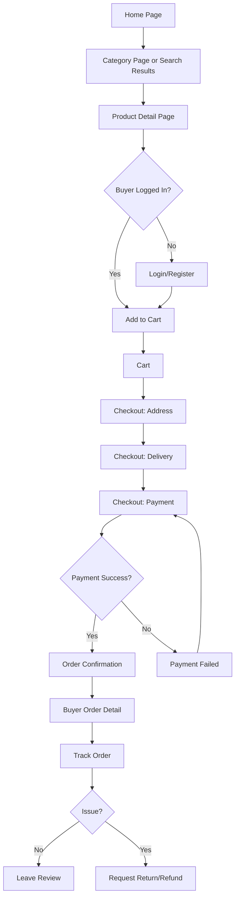

## 5.2 Seller onboarding-to-first-product flow

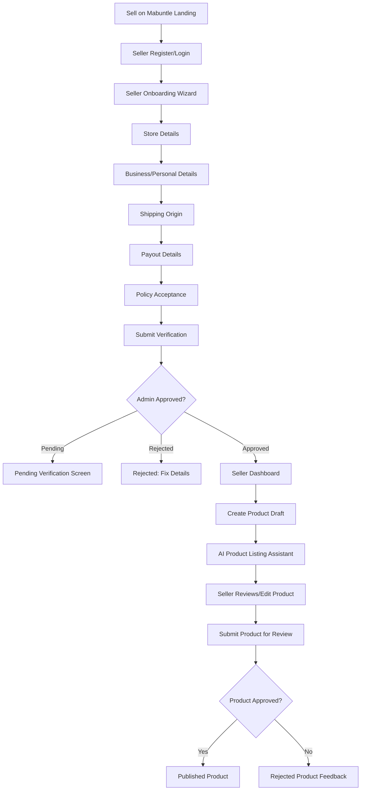

## 5.3 Buyer AI shopping assistant flow

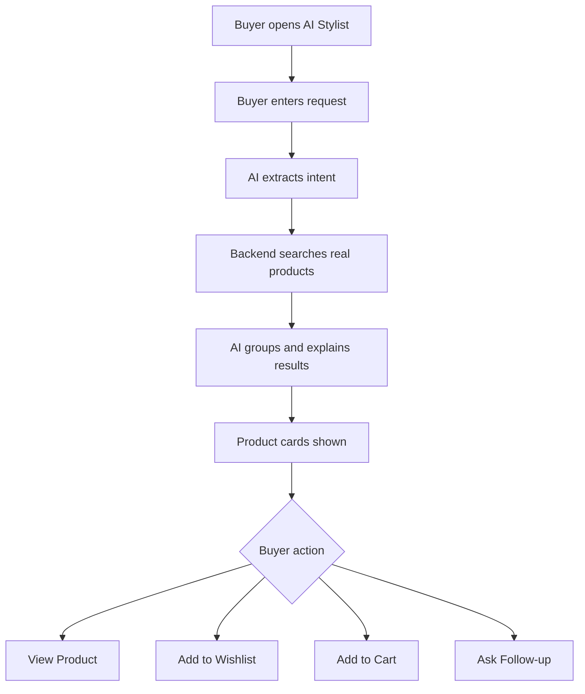

## 5.4 Admin moderation flow

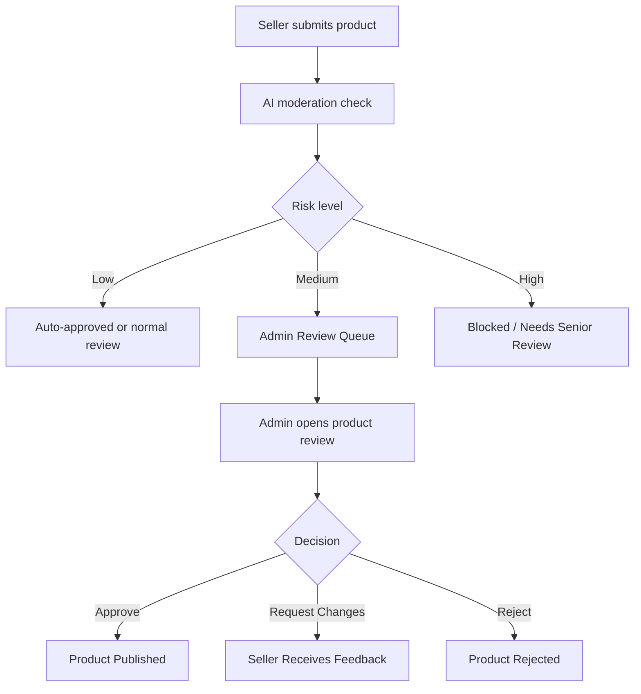

## 5.5 Seller ad campaign flow

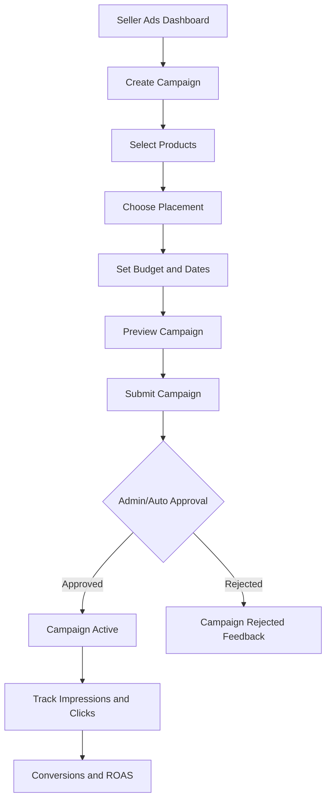

---

# 6. Screen inventory summary

## 6.1 Buyer and public screens

| ID | Screen | Phase | Primary purpose |
|---|---|---:|---|
| B-01 | Home Page | MVP | Entry point and featured shopping areas |
| B-02 | Category Landing Page | MVP | Browse product categories |
| B-03 | Product Listing/Search Results | MVP | Search, filter, and sort products |
| B-04 | Product Detail Page | MVP | Product information and add to cart |
| B-05 | Seller Storefront | MVP | View seller profile and products |
| B-06 | Wishlist | MVP | Saved products |
| B-07 | Cart | MVP | Review cart before checkout |
| B-08 | Checkout Address | MVP | Delivery details |
| B-09 | Checkout Delivery | MVP | Shipping option selection |
| B-10 | Checkout Payment | MVP | Payment and final confirmation |
| B-11 | Payment Failed | MVP | Failed payment recovery |
| B-12 | Order Confirmation | MVP | Successful purchase confirmation |
| B-13 | Buyer Account Dashboard | MVP | Account overview |
| B-14 | Buyer Orders List | MVP | View purchase history |
| B-15 | Buyer Order Detail | MVP | Track order and request help |
| B-16 | Return/Refund Request | MVP | Start return/refund request |
| B-17 | Leave Review | MVP | Review seller/product |
| B-18 | Notifications | MVP | Order and platform updates |
| B-19 | AI Shopping Assistant | Later | Natural-language product discovery |
| B-20 | Visual Search Upload | Later | Find similar products from an image |

## 6.2 Seller screens

| ID | Screen | Phase | Primary purpose |
|---|---|---:|---|
| S-01 | Sell on Mabuntle Landing | MVP | Explain seller benefits |
| S-02 | Seller Registration/Login | MVP | Seller access |
| S-03 | Seller Onboarding Wizard | MVP | Capture seller details |
| S-04 | Seller Verification Status | MVP | Pending/rejected/approved state |
| S-05 | Seller Dashboard | MVP | Seller overview |
| S-06 | Products List | MVP | Manage products |
| S-07 | Create/Edit Product: Images | MVP | Upload product photos |
| S-08 | Create/Edit Product: Basic Details | MVP | Title, description, category |
| S-09 | AI Product Listing Assistant | MVP | Generate listing suggestions |
| S-10 | Product Attributes | MVP | Category-specific details |
| S-11 | Product Variants & Stock | MVP | Sizes, colours, SKU, inventory |
| S-12 | Pricing & Shipping | MVP | Price, delivery settings |
| S-13 | Product Review & Submit | MVP | Final check before submission |
| S-14 | Product Detail/Edit Screen | MVP | Maintain product listing |
| S-15 | Inventory Management | MVP | Manage stock levels |
| S-16 | Seller Orders List | MVP | View orders |
| S-17 | Seller Order Detail/Fulfilment | MVP | Pack, ship, track order |
| S-18 | Seller Returns | MVP | Respond to return requests |
| S-19 | Seller Payouts/Balance | MVP | View earnings and payout status |
| S-20 | Seller Storefront Settings | MVP | Manage store details |
| S-21 | Seller Analytics | Later | Sales/product performance |
| S-22 | Seller Ads Dashboard | Later | Campaign performance |
| S-23 | Create Ad Campaign | Later | Promote products/store |
| S-24 | Seller Support Tickets | MVP | Contact platform support |

## 6.3 Admin and support screens

| ID | Screen | Phase | Primary purpose |
|---|---|---:|---|
| A-01 | Admin Login | MVP | Admin access |
| A-02 | Admin Dashboard | MVP | Operational overview |
| A-03 | Seller Approval Queue | MVP | Review new sellers |
| A-04 | Seller Review Detail | MVP | Approve/reject seller |
| A-05 | Product Moderation Queue | MVP | Review submitted/flagged products |
| A-06 | Product Review Detail | MVP | Approve/reject product |
| A-07 | Orders Admin | MVP | Monitor orders |
| A-08 | Order Detail Admin | MVP | Investigate order issues |
| A-09 | Payment/Ledger Overview | MVP | Track payments and ledger entries |
| A-10 | Seller Payout Queue | MVP | Review pending payouts |
| A-11 | Refunds Queue | MVP | Manage refunds |
| A-12 | Dispute Case Detail | MVP | Resolve buyer/seller disputes |
| A-13 | Category Manager | MVP | Manage category tree |
| A-14 | Attribute Manager | MVP | Manage category attributes |
| A-15 | AI Moderation Dashboard | MVP/Later | Review AI flags and usage |
| A-16 | Support Ticket Queue | MVP | Handle support requests |
| A-17 | Ad Campaign Approval Queue | Later | Approve/reject ads |
| A-18 | Campaign Review Detail | Later | Review ad eligibility |
| A-19 | Reports & Analytics | Later | Marketplace performance |
| A-20 | Audit Logs | MVP | Track sensitive admin actions |
| A-21 | Platform Settings | MVP/Later | Fees, policies, roles, feature flags |

---

# 7. Public and buyer UX screens in detail

## B-01: Home Page

### Purpose

Introduce Mabuntle and drive users into shopping categories, featured collections, new arrivals, and promotional areas.

### Main users

- Guest
- Buyer

### Key sections

1. Header/navigation
2. Search bar
3. Hero banner
4. Category tiles
5. New arrivals
6. Trending products
7. Beauty spotlight
8. Jewellery spotlight
9. Featured sellers
10. Trust strip
11. Footer

### Main CTAs

- Shop New Arrivals
- Explore Clothing
- Shop Beauty
- Become a Seller
- View Featured Stores

### UX notes

The home page should be visually rich but not overloaded. Product images should dominate. Use a large search bar because many buyers will arrive knowing roughly what they want.

### Flow

```txt
Home Page
  ├── Search query → Search Results
  ├── Category tile → Category Page
  ├── Product card → Product Detail
  ├── Featured seller → Seller Storefront
  └── Become a Seller → Sell on Mabuntle Landing
```

---

## B-02: Category Landing Page

### Purpose

Help buyers browse broad category groups.

### Example categories

- Women
- Men
- Kids
- Shoes
- Jewellery
- Accessories
- Beauty
- New Arrivals
- Sale
- Featured Sellers

### Components

- Category hero image
- Subcategory cards
- Trending filters
- Featured products
- Popular brands/sellers

### Flow

```txt
Category Landing
  ├── Subcategory → Product Listing/Search Results
  ├── Featured product → Product Detail
  └── Seller collection → Seller Storefront
```

---

## B-03: Product Listing/Search Results

### Purpose

Allow buyers to find products using search, filters, sorting, and category browsing.

### Key components

- Search result title
- Product count
- Search bar
- Filter sidebar or mobile drawer
- Sort dropdown
- Product grid
- Sponsored row, later
- Empty state
- Loading skeletons

### Filters

- Category
- Price range
- Size
- Colour
- Brand
- Material
- Condition
- Seller rating
- Availability
- Location, if relevant
- Delivery options

### Sort options

- Recommended
- Newest
- Price: Low to High
- Price: High to Low
- Popular
- Highest Rated

### Flow

```txt
Search Results
  ├── Apply filters → Updated results
  ├── Sort → Updated results
  ├── Product card → Product Detail
  ├── Wishlist icon → Add to Wishlist
  ├── Quick add → Add to Cart, if variant selected
  └── No results → Suggestions / AI Shopping Assistant
```

### Empty state copy

```txt
No products found.
Try adjusting your filters or search for something more general.
```

Later AI suggestion:

```txt
Need help finding the right item? Ask Mabuntle Stylist.
```

---

## B-04: Product Detail Page

### Purpose

Give the buyer enough confidence to buy.

### Key sections

1. Product image gallery
2. Product title
3. Price
4. Seller badge
5. Rating/reviews
6. Variant selectors
7. Stock availability
8. Add to cart button
9. Wishlist button
10. Product description
11. Product attributes
12. Shipping/returns information
13. Beauty safety fields, where applicable
14. Seller information
15. Similar products
16. Report product link

### Variant selectors

For clothing:

- Size
- Colour

For beauty:

- Shade
- Volume

For jewellery/accessories:

- Colour
- Size/length/ring size, if applicable

### Main CTAs

- Add to Cart
- Buy Now, optional later
- Add to Wishlist
- Ask Seller, optional later

### Trust elements

- Verified seller badge
- Secure checkout message
- Delivery estimate
- Return policy summary
- Product approval badge, optional internal trust label

### Flow

```txt
Product Detail
  ├── Select variant → Check stock
  ├── Add to Cart → Cart Drawer / Cart Page
  ├── Wishlist → Wishlist
  ├── Seller name → Seller Storefront
  ├── Similar product → Product Detail
  └── Report product → Report Modal
```

---

## B-05: Seller Storefront

### Purpose

Let buyers browse a specific seller's store and build trust.

### Key sections

- Seller banner
- Seller logo/profile image
- Store name
- Verified badge
- Seller rating
- Number of products
- Return/shipping summary
- Store categories
- Product grid
- Seller policies
- Reviews

### CTAs

- Follow Seller, later
- View Products
- Contact Support about Seller, if needed

### Flow

```txt
Seller Storefront
  ├── Product card → Product Detail
  ├── Category filter → Store filtered results
  └── Seller reviews → Review section
```

---

## B-06: Wishlist

### Purpose

Allow buyers to save products for later.

### Key components

- Wishlist grid
- Price
- Stock state
- Add to cart
- Remove from wishlist
- Price drop badge, later
- Back in stock alert, later

### Flow

```txt
Wishlist
  ├── Product card → Product Detail
  ├── Add to Cart → Cart
  └── Remove → Wishlist updated
```

---

## B-07: Cart

### Purpose

Review selected products before checkout.

### MVP recommendation

Start with single-seller checkout. If the buyer tries to add items from another seller, show a clear message.

### Key components

- Cart item list
- Product image
- Product title
- Selected variant
- Quantity
- Price
- Remove item
- Stock warnings
- Cart total
- Shipping estimate
- Proceed to checkout button

### Single-seller cart warning

```txt
For now, checkout supports one seller at a time. Please complete this order or clear your cart before adding products from another seller.
```

### Flow

```txt
Cart
  ├── Update quantity → Recalculate total
  ├── Remove item → Recalculate total
  ├── Continue shopping → Previous/category page
  └── Proceed to Checkout → Checkout Address
```

---

## B-08: Checkout Address

### Purpose

Collect delivery address and buyer contact details.

### Components

- Saved addresses
- New address form
- Phone number
- Delivery notes
- Continue button

### Validation

- Required fields
- Valid phone number
- Postal code, if required

### Flow

```txt
Checkout Address
  ├── Select saved address → Delivery step
  ├── Add new address → Save address
  └── Continue → Checkout Delivery
```

---

## B-09: Checkout Delivery

### Purpose

Confirm shipping method and cost.

### MVP version

Manual or flat seller shipping.

### Later version

Courier quotes and delivery options.

### Components

- Seller shipping method
- Delivery estimate
- Shipping fee
- Delivery notes
- Order summary

### Flow

```txt
Checkout Delivery
  ├── Select delivery option → Update total
  └── Continue → Checkout Payment
```

---

## B-10: Checkout Payment

### Purpose

Final order review and payment.

### Components

- Order summary
- Product list
- Delivery address
- Shipping method
- Total amount
- Platform trust message
- Payment method container
- Terms acceptance
- Pay button

### Flow

```txt
Checkout Payment
  ├── Pay → Payment provider
  ├── Payment success → Order Confirmation
  └── Payment failed → Payment Failed Screen
```

---

## B-11: Payment Failed

### Purpose

Help buyer recover from failed payment.

### Components

- Error message
- Order/cart summary
- Retry payment button
- Change payment method
- Contact support link

### Flow

```txt
Payment Failed
  ├── Retry → Checkout Payment
  ├── Change payment method → Checkout Payment
  └── Return to cart → Cart
```

---

## B-12: Order Confirmation

### Purpose

Confirm order success and provide next steps.

### Components

- Success message
- Order number
- Seller name
- Estimated delivery
- View order button
- Continue shopping

### Flow

```txt
Order Confirmation
  ├── View Order → Buyer Order Detail
  └── Continue Shopping → Home/Category
```

---

## B-13: Buyer Account Dashboard

### Purpose

Buyer account overview.

### Components

- Profile summary
- Recent orders
- Wishlist count
- Saved addresses
- Notifications
- Returns/refunds summary

### Flow

```txt
Account Dashboard
  ├── Orders → Orders List
  ├── Wishlist → Wishlist
  ├── Addresses → Address Management
  ├── Returns → Returns List
  └── Settings → Account Settings
```

---

## B-14: Buyer Orders List

### Purpose

Show all buyer orders.

### Components

- Order cards/table
- Order number
- Date
- Seller
- Total
- Status
- View details

### Flow

```txt
Orders List
  └── View Order → Buyer Order Detail
```

---

## B-15: Buyer Order Detail

### Purpose

Track order and handle post-purchase actions.

### Components

- Order status timeline
- Product list
- Seller details
- Payment summary
- Shipping/tracking information
- Return/refund button
- Review button after delivery
- Support link

### Flow

```txt
Order Detail
  ├── Track shipment → Tracking section/link
  ├── Request return/refund → Return Request
  ├── Leave review → Review Screen
  └── Contact support → Support Ticket
```

---

## B-16: Return/Refund Request

### Purpose

Allow buyers to request returns or refunds.

### Components

- Select item
- Return reason
- Description
- Upload evidence images
- Preferred resolution
- Submit button

### Return reasons

- Wrong size
- Wrong item
- Damaged item
- Not as described
- Expired beauty product
- Counterfeit concern
- Late delivery
- Other

### Flow

```txt
Return Request
  ├── Submit → Return Created
  └── Return Created → Buyer Order Detail / Returns List
```

---

## B-17: Leave Review

### Purpose

Collect buyer feedback after purchase.

### Components

- Product rating
- Seller rating
- Review text
- Image upload, optional
- Fit feedback for clothing, later
- Submit button

### Flow

```txt
Leave Review
  └── Submit → Order Detail / Product Reviews
```

---

## B-18: Notifications

### Purpose

Show buyer updates.

### Notification types

- Order confirmed
- Payment received
- Order shipped
- Order delivered
- Return update
- Refund update
- Wishlist price drop, later
- Back in stock, later

---

## B-19: AI Shopping Assistant

### Purpose

Help buyers find products using natural language.

### Example prompts

```txt
I need an outfit for a wedding under R1,500.
Find gold earrings for sensitive ears.
Show me black dresses in size medium.
Find a birthday gift under R500.
```

### Components

- Chat input
- Suggested prompt chips
- Product recommendation cards
- Budget summary
- Follow-up questions
- Add to wishlist/cart buttons

### Important rule

The AI assistant must only recommend real products returned by the backend search.

### Flow

```txt
AI Shopping Assistant
  ├── Buyer enters request
  ├── AI extracts intent
  ├── Backend finds matching products
  ├── AI groups/explains products
  ├── Buyer clicks product → Product Detail
  ├── Buyer adds product → Cart/Wishlist
  └── Buyer asks follow-up → Updated recommendations
```

---

## B-20: Visual Search Upload

### Purpose

Allow buyers to upload an image and find similar products.

### Components

- Upload image
- Preview image
- AI description summary
- Similar products grid
- Filters

### Flow

```txt
Visual Search
  ├── Upload image
  ├── AI identifies category/style/colour
  ├── Search finds products
  └── Buyer views product cards
```

---

# 8. Seller UX screens in detail

## S-01: Sell on Mabuntle Landing

### Purpose

Convince sellers to join Mabuntle.

### Key sections

- Seller value proposition
- Free listing message
- Transaction fee only message
- AI listing assistant highlight
- Advertising opportunities later
- How it works
- Seller FAQs
- CTA to register

### Suggested copy

```txt
Sell fashion, beauty, jewellery, and accessories on Mabuntle.
Create your store for free. List products for free. Pay only when you sell.
```

### Flow

```txt
Sell Landing
  ├── Start Selling → Seller Registration
  └── Learn Fees → Fee Explanation Section
```

---

## S-02: Seller Registration/Login

### Purpose

Allow sellers to register or log in.

### Components

- Email/password fields
- Role selection, if shared auth
- Terms acceptance
- Link to buyer login
- Forgot password

### Flow

```txt
Seller Registration
  ├── New seller → Onboarding Wizard
  └── Existing seller → Seller Dashboard
```

---

## S-03: Seller Onboarding Wizard

### Purpose

Collect seller information before allowing transactions.

### Steps

1. Store basics
2. Seller details
3. Business details, if applicable
4. Shipping origin address
5. Payout details
6. Policies and agreement
7. Review and submit

### Step 1: Store basics

Fields:

- Store name
- Store slug
- Store description
- Store logo
- Store banner
- Category focus

### Step 2: Seller details

Fields:

- Full name
- Email
- Phone number
- Address

### Step 3: Business details

Fields:

- Individual or business seller
- Business name
- Registration number, optional initially
- VAT number, optional

### Step 4: Shipping origin

Fields:

- Pickup/shipping address
- Default processing time
- Delivery areas, if relevant

### Step 5: Payout details

Fields:

- Bank account holder name
- Bank name
- Account number/tokenized payment provider reference
- Confirmation checkbox

### Step 6: Policies

Fields:

- Accept seller agreement
- Accept marketplace fee policy
- Accept prohibited products policy
- Accept advertising terms, later

### Flow

```txt
Onboarding Wizard
  ├── Save draft → Seller Verification Status
  ├── Submit → Verification Pending
  └── Rejected → Fix details and resubmit
```

---

## S-04: Seller Verification Status

### Purpose

Show seller whether they can sell yet.

### States

- Pending verification
- Approved
- Rejected
- Suspended
- Needs more information

### Components

- Status card
- What happens next
- Required actions
- Contact support link

### Flow

```txt
Verification Status
  ├── Approved → Seller Dashboard
  ├── Needs Info → Onboarding Wizard
  └── Support → Seller Support Ticket
```

---

## S-05: Seller Dashboard

### Purpose

Give seller operational overview.

### Cards

- Sales this month
- Pending orders
- Products published
- Products pending review
- Low stock products
- Pending payout
- AI listing suggestions used
- Campaign performance, later

### Quick actions

- Create product
- View orders
- Manage inventory
- View payouts
- Create campaign, later

### Flow

```txt
Seller Dashboard
  ├── Create Product → Product Creation Wizard
  ├── Orders → Seller Orders List
  ├── Products → Products List
  ├── Payouts → Seller Payouts
  └── Ads → Seller Ads Dashboard
```

---

## S-06: Products List

### Purpose

Manage seller product catalog.

### Components

- Product table/grid
- Product image
- Title
- Status
- Stock
- Price
- Category
- Last updated
- Actions

### Statuses

- Draft
- Pending review
- Published
- Rejected
- Out of stock
- Archived

### Actions

- Edit
- Duplicate
- Archive
- Submit for review
- View public page
- Use AI assistant

### Flow

```txt
Products List
  ├── New Product → Product Creation Wizard
  ├── Edit Product → Product Edit Screen
  ├── Use AI → AI Product Listing Assistant
  └── View Public → Product Detail Page
```

---

## S-07 to S-13: Product Creation Wizard

### Purpose

Allow sellers to create a product listing with variants and enough information for buyers.

### Recommended stepper

```txt
1. Images
2. Basic Details
3. AI Suggestions
4. Attributes
5. Variants & Stock
6. Pricing & Shipping
7. Review & Submit
```

---

## S-07: Product Creation - Images

### Components

- Drag/drop upload
- Image previews
- Reorder images
- Delete image
- Main image selector
- Image quality hints

### AI image feedback, later

- Background quality
- Lighting quality
- Product visibility
- Suggested missing angles

### Flow

```txt
Images Step
  ├── Upload images → Preview
  ├── Set main image → Main image updated
  └── Continue → Basic Details
```

---

## S-08: Product Creation - Basic Details

### Components

- Product title
- Short seller notes
- Description
- Category selector
- Brand, optional
- Condition

### AI prompt trigger

```txt
Generate with AI
```

### Flow

```txt
Basic Details
  ├── Generate with AI → AI Product Listing Assistant
  ├── Continue manually → Attributes
  └── Save draft → Products List
```

---

## S-09: AI Product Listing Assistant

### Purpose

Help seller create high-quality product content.

### Components

- AI assistant panel
- Input summary
- Suggested title
- Alternative titles
- Suggested description
- Suggested category
- Suggested attributes
- Suggested tags
- Missing fields
- Risk warnings
- Quality score
- Accept/edit controls

### Suggested layout

```txt
Left side:
Product draft form

Right side:
AI suggestions panel
```

### Actions

- Generate suggestions
- Regenerate
- Apply title
- Apply description
- Apply category
- Apply attributes
- Apply all safe suggestions
- Dismiss suggestion

### Safety copy

```txt
AI suggestions are drafts. Please confirm all product details before publishing.
```

### Flow

```txt
AI Assistant
  ├── Generate → Suggestions displayed
  ├── Apply suggestions → Product form updated
  ├── Edit fields → Seller changes content
  └── Continue → Attributes / Review
```

---

## S-10: Product Attributes

### Purpose

Capture category-specific details.

### Clothing attributes

- Size system
- Material
- Colour
- Fit
- Pattern
- Sleeve length
- Neckline
- Occasion
- Care instructions
- Measurements

### Jewellery attributes

- Material
- Metal type
- Stone type
- Length
- Ring size
- Hypoallergenic status
- Certificate/authenticity info

### Beauty attributes

- Brand
- Shade
- Skin type
- Ingredients
- Expiry date
- Batch number
- Sealed/unsealed
- Volume/weight
- Warnings

### Flow

```txt
Attributes Step
  ├── Complete required attributes
  ├── Missing fields shown
  └── Continue → Variants & Stock
```

---

## S-11: Product Variants & Stock

### Purpose

Manage variant-level pricing and inventory.

### Components

- Variant table
- Size
- Colour
- SKU
- Price
- Stock quantity
- Status
- Bulk add variants

### Validation

- Stock cannot be negative
- Price required
- At least one active variant required before submission

### Flow

```txt
Variants Step
  ├── Add variant → Variant row added
  ├── Bulk create variants → Variant table generated
  └── Continue → Pricing & Shipping
```

---

## S-12: Pricing & Shipping

### Purpose

Set product pricing and fulfilment settings.

### Components

- Base price
- Sale price, optional
- Shipping fee model
- Processing time
- Return eligibility
- Beauty restrictions, if applicable

### Flow

```txt
Pricing & Shipping
  ├── Save draft
  └── Continue → Review & Submit
```

---

## S-13: Product Review & Submit

### Purpose

Final seller review before moderation/admin review.

### Components

- Product preview card
- Listing quality score
- Missing fields checklist
- Risk flags
- Product summary
- Submit for review button

### Flow

```txt
Review & Submit
  ├── Fix missing fields → Relevant step
  ├── Submit for review → Product Pending Review
  └── Save draft → Products List
```

---

## S-14: Product Detail/Edit Screen

### Purpose

Edit existing product after draft or publication.

### Components

- Product status banner
- Editable fields
- Variant table
- Image manager
- Moderation feedback
- Version history, later

### Flow

```txt
Product Edit
  ├── Save changes → Draft/Published update
  ├── Submit changes → Pending Review, if sensitive
  └── Archive product → Products List
```

---

## S-15: Inventory Management

### Purpose

Manage stock across products and variants.

### Components

- Inventory table
- Filters by low stock/out of stock
- Bulk stock update
- Stock history
- Reservation status, later

### Flow

```txt
Inventory
  ├── Update stock → Stock saved
  ├── View product → Product Edit
  └── Low stock alert → Restock action
```

---

## S-16: Seller Orders List

### Purpose

Show seller orders requiring action.

### Components

- Order number
- Buyer first name or anonymized buyer label
- Products
- Total
- Payment status
- Fulfilment status
- Date
- Action buttons

### Filters

- Paid
- Awaiting fulfilment
- Shipped
- Delivered
- Return requested
- Disputed

### Flow

```txt
Orders List
  └── View Order → Seller Order Detail
```

---

## S-17: Seller Order Detail/Fulfilment

### Purpose

Allow seller to fulfil order.

### Components

- Order summary
- Product list
- Buyer delivery address, when allowed
- Fulfilment checklist
- Tracking number upload
- Courier name
- Mark as shipped
- Return/dispute warnings

### Flow

```txt
Seller Order Detail
  ├── Mark preparing → Order updated
  ├── Add tracking → Tracking saved
  ├── Mark shipped → Buyer notified
  └── Return requested → Seller Returns
```

---

## S-18: Seller Returns

### Purpose

Allow sellers to respond to return/refund requests.

### Components

- Return request list
- Return reason
- Evidence images
- Buyer comments
- Platform policy summary
- Accept/reject response
- Escalate to admin

### Flow

```txt
Seller Returns
  ├── Accept return → Return approved
  ├── Reject return → Dispute/Admin review
  └── View case → Return Detail
```

---

## S-19: Seller Payouts/Balance

### Purpose

Show seller earnings and payout status.

### Components

- Pending balance
- Available balance
- On-hold balance
- Paid out amount
- Ledger entries
- Payout history
- Fee breakdown

### Flow

```txt
Payouts
  ├── View ledger entry → Ledger detail
  ├── Request payout, if manual → Payout request
  └── Update bank details → Seller Settings, with verification
```

---

## S-20: Seller Storefront Settings

### Purpose

Manage seller storefront appearance and information.

### Components

- Store logo
- Banner image
- Store name
- Store description
- Store categories
- Policy summary
- Preview storefront

### Flow

```txt
Storefront Settings
  ├── Save changes → Store updated
  └── Preview → Public Seller Storefront
```

---

## S-21: Seller Analytics

### Purpose

Show sellers how their store is performing.

### Metrics

- Sales
- Orders
- Conversion rate
- Top products
- Low stock
- Returns
- Product views
- Wishlist adds
- Search appearances
- Ad campaign performance, later

---

## S-22: Seller Ads Dashboard

### Purpose

Let sellers manage campaigns.

### Components

- Campaign cards/table
- Status
- Budget
- Spend
- Impressions
- Clicks
- Orders
- Revenue
- ROAS

### Flow

```txt
Ads Dashboard
  ├── Create Campaign → Create Ad Campaign
  ├── View Campaign → Campaign Detail
  └── Pause/Resume → Campaign status updated
```

---

## S-23: Create Ad Campaign

### Purpose

Allow sellers to promote products or storefront.

### Steps

1. Choose campaign type
2. Select products
3. Select placement
4. Set budget
5. Set dates
6. Preview
7. Submit

### Campaign types

- Featured product
- Sponsored category listing
- Sponsored search result
- Featured storefront, later

### Flow

```txt
Create Campaign
  ├── Select products
  ├── Set targeting/budget
  ├── Preview
  └── Submit → Pending Approval / Active
```

---

## S-24: Seller Support Tickets

### Purpose

Allow sellers to contact Mabuntle support.

### Common topics

- Verification
- Product rejection
- Payment/payout
- Order issue
- Return dispute
- Ad campaign issue

---

# 9. Admin and support UX screens in detail

## A-01: Admin Login

### Purpose

Secure admin access.

### Components

- Email/password
- Two-factor authentication, recommended
- Forgot password
- Security notice

### Flow

```txt
Admin Login
  ├── Successful login → Admin Dashboard
  └── Failed login → Error state
```

---

## A-02: Admin Dashboard

### Purpose

Provide operations overview.

### Key cards

- Pending seller approvals
- Pending product reviews
- Open disputes
- Pending refunds
- Pending payouts
- Orders today
- Gross sales
- AI moderation flags
- Active campaigns

### Flow

```txt
Admin Dashboard
  ├── Seller approvals → Seller Queue
  ├── Product reviews → Product Moderation Queue
  ├── Disputes → Disputes Queue
  ├── Payouts → Payout Queue
  └── Reports → Analytics
```

---

## A-03: Seller Approval Queue

### Purpose

Review sellers waiting for verification.

### Components

- Seller list
- Store name
- Seller type
- Submitted date
- Risk indicators
- Verification status
- Actions

### Flow

```txt
Seller Approval Queue
  └── Open Seller → Seller Review Detail
```

---

## A-04: Seller Review Detail

### Purpose

Approve or reject sellers.

### Sections

- Seller identity details
- Store details
- Business details
- Payout details summary
- Shipping origin
- Documents, if applicable
- Risk notes
- Admin decision panel

### Actions

- Approve
- Request more information
- Reject
- Suspend
- Add internal note

### Flow

```txt
Seller Review Detail
  ├── Approve → Seller Verified
  ├── Request Info → Seller Needs Info
  ├── Reject → Seller Rejected
  └── Suspend → Seller Suspended
```

---

## A-05: Product Moderation Queue

### Purpose

Review submitted or flagged products.

### Components

- Product thumbnail
- Product title
- Seller
- Category
- Risk flags
- AI moderation summary
- Submitted date
- Status

### Filters

- Pending review
- AI flagged
- Beauty claim risk
- Counterfeit risk
- High-value item
- Seller risk

### Flow

```txt
Product Moderation Queue
  └── Open Product → Product Review Detail
```

---

## A-06: Product Review Detail

### Purpose

Allow admin to approve, reject, or request changes to a product.

### Sections

- Product preview
- Image gallery
- Seller details
- Category and attributes
- Variants and stock
- AI suggestion history
- AI moderation result
- Risk flags
- Admin notes
- Decision panel

### Actions

- Approve
- Reject
- Request changes
- Escalate
- Suspend seller, if severe

### Flow

```txt
Product Review Detail
  ├── Approve → Product Published
  ├── Request Changes → Seller notified
  ├── Reject → Product Rejected
  └── Escalate → Senior review queue
```

---

## A-07: Orders Admin

### Purpose

Monitor platform orders.

### Components

- Order table
- Buyer
- Seller
- Status
- Payment status
- Fulfilment status
- Total
- Date

### Filters

- Paid
- Processing
- Shipped
- Delivered
- Return requested
- Disputed
- Cancelled

### Flow

```txt
Orders Admin
  └── Open Order → Order Detail Admin
```

---

## A-08: Order Detail Admin

### Purpose

Investigate an order.

### Sections

- Order summary
- Buyer details
- Seller details
- Products
- Payment events
- Ledger entries
- Shipment events
- Return/refund status
- Internal notes

### Actions

- Add note
- Escalate dispute
- Trigger refund flow
- Hold seller payout
- Contact buyer/seller

---

## A-09: Payment/Ledger Overview

### Purpose

Track payment and ledger health.

### Components

- Gross payments
- Payment provider fees
- Platform commission
- Seller payable balances
- Refunds
- Failed payments
- Ledger entry table

### Filters

- Date range
- Seller
- Order
- Payment status
- Ledger entry type

---

## A-10: Seller Payout Queue

### Purpose

Review and process seller payouts.

### Components

- Seller
- Available balance
- On-hold balance
- Payout eligibility
- Risk flags
- Last payout
- Action buttons

### Actions

- Approve payout
- Hold payout
- Mark paid
- Request verification
- Add note

### Flow

```txt
Payout Queue
  ├── Approve → Payout Processing/Paid
  ├── Hold → Seller balance held
  └── View seller → Seller Review Detail
```

---

## A-11: Refunds Queue

### Purpose

Review pending refunds.

### Components

- Refund request
- Buyer
- Seller
- Order
- Reason
- Amount
- Evidence
- Status

### Actions

- Approve refund
- Reject refund
- Request more information
- Escalate dispute

---

## A-12: Dispute Case Detail

### Purpose

Resolve buyer/seller disputes.

### Sections

- Case summary
- Buyer statement
- Seller response
- Evidence images
- Order timeline
- Payment/ledger status
- Admin notes
- Decision panel

### Actions

- Refund buyer
- Release seller payout
- Partial refund
- Close case
- Suspend seller

---

## A-13: Category Manager

### Purpose

Manage Mabuntle category tree.

### Components

- Category tree
- Add/edit category
- Slug
- Parent category
- Required attributes
- Visibility
- Sort order

---

## A-14: Attribute Manager

### Purpose

Manage category-specific product attributes.

### Attribute examples

- Size
- Colour
- Material
- Fit
- Skin type
- Ingredients
- Expiry date
- Ring size
- Stone type

### Components

- Attribute list
- Type selector
- Required/optional flag
- Category mapping
- Allowed values

---

## A-15: AI Moderation Dashboard

### Purpose

Track AI flags and AI usage.

### Components

- AI flagged products
- Flag types
- Model used
- Confidence/risk score
- Admin override history
- AI cost metrics
- Prompt version

### Flow

```txt
AI Moderation Dashboard
  ├── Open flagged product → Product Review Detail
  └── View usage → AI Usage Reports
```

---

## A-16: Support Ticket Queue

### Purpose

Handle buyer and seller support tickets.

### Components

- Ticket table
- User type
- Topic
- Status
- Priority
- Assigned agent
- Last update

### Flow

```txt
Ticket Queue
  └── Open Ticket → Ticket Detail
```

---

## A-17: Ad Campaign Approval Queue

### Purpose

Review seller campaign submissions.

### Components

- Campaign name
- Seller
- Product(s)
- Placement
- Budget
- Dates
- Eligibility status
- Product quality score
- Seller risk score

### Flow

```txt
Ad Approval Queue
  └── Open Campaign → Campaign Review Detail
```

---

## A-18: Campaign Review Detail

### Purpose

Approve or reject seller campaigns.

### Sections

- Campaign preview
- Product eligibility
- Seller status
- Budget/dates
- Placement
- Risk flags
- Admin decision

### Actions

- Approve
- Reject
- Request changes
- Pause campaign

---

## A-19: Reports & Analytics

### Purpose

Track platform performance.

### Reports

- GMV
- Orders
- Conversion rate
- Refund rate
- Return rate
- Seller activation
- Buyer retention
- Top categories
- Top sellers
- AI usage
- Ad revenue

---

## A-20: Audit Logs

### Purpose

Track sensitive admin/system actions.

### Log fields

- User/admin
- Action
- Entity
- Previous value
- New value
- Timestamp
- IP/device metadata, optional
- Reason

---

## A-21: Platform Settings

### Purpose

Configure platform rules.

### Settings groups

- Marketplace fees
- Seller policies
- Return policies
- Product moderation rules
- Ad campaign rules
- AI settings
- Feature flags
- Email templates
- Roles and permissions

---

# 10. AI-specific UX flows

## 10.1 AI Fashion Product Listing Assistant flow

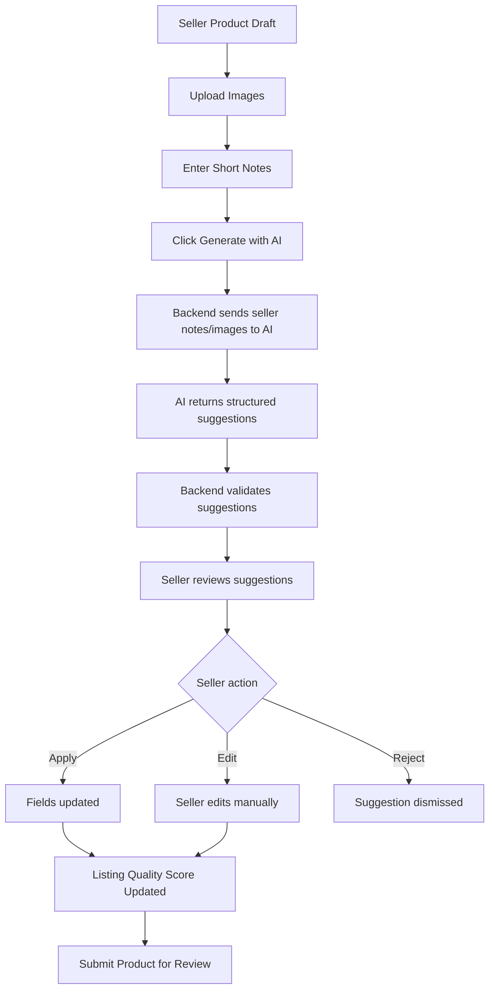

### UX requirements

- Seller can accept individual suggestions.
- Seller can edit all AI-generated content.
- AI-generated risky claims must be shown as warnings.
- AI should not silently fill high-risk fields such as brand authenticity, beauty claims, ingredients, or material unless seller confirms.
- Quality score should update after seller improves the listing.

---

## 10.2 AI moderation flow

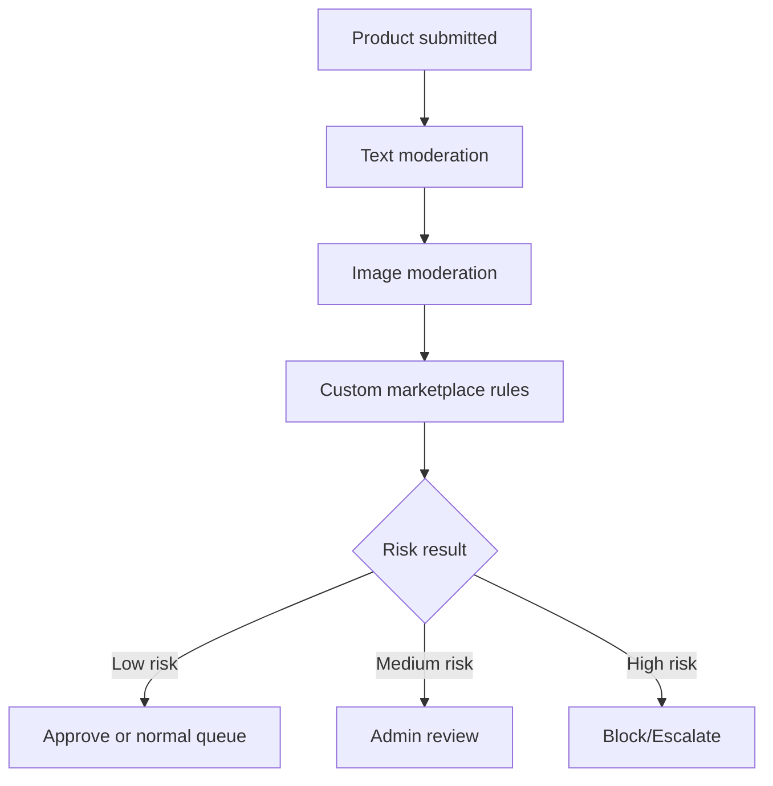

### Risk categories

- Unsafe content
- Counterfeit wording
- Beauty medical claims
- Missing beauty safety fields
- Suspicious seller history
- Inappropriate images
- Misleading product description

---

## 10.3 Buyer AI shopping assistant flow

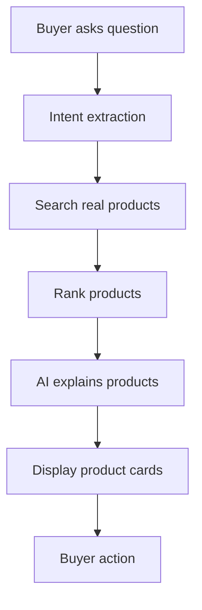

### UX rule

AI responses should be paired with actual product cards. Avoid pure text recommendations.

---

# 11. Payment and order UX flows

## 11.1 Checkout and payment

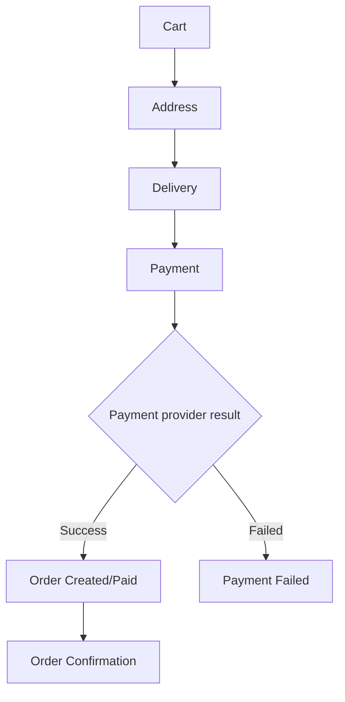

## 11.2 Payment webhook and order status UX

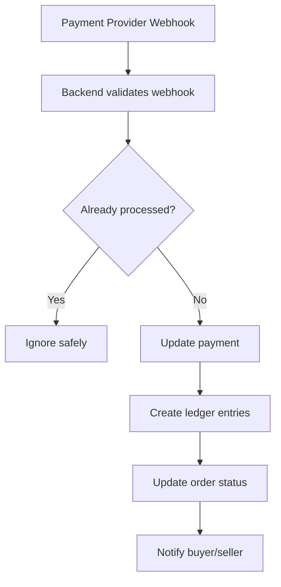

## 11.3 Seller payout flow

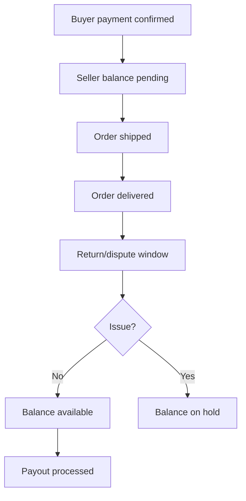

---

# 12. Returns, refunds, and disputes UX flows

## 12.1 Return request flow

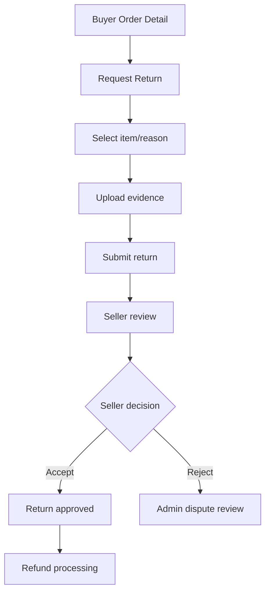

## 12.2 Dispute flow

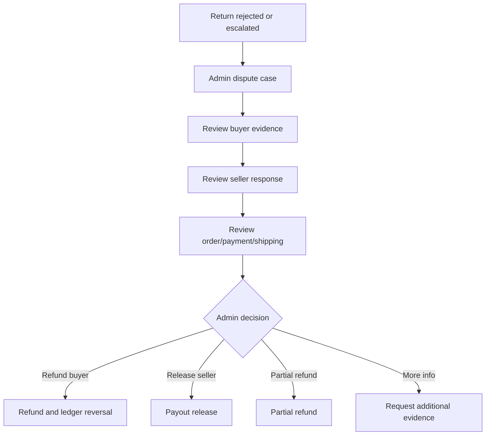

---

# 13. Advertising UX flows

## 13.1 Seller promoted listing flow

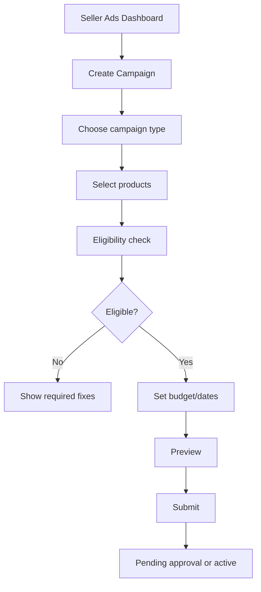

## 13.2 Ad performance flow

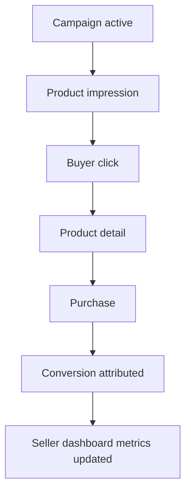

### Seller campaign dashboard metrics

- Impressions
- Clicks
- Click-through rate
- Spend
- Orders
- Revenue
- ROAS
- Cost per order

---

# 14. Notification UX

## 14.1 Buyer notifications

- Order confirmed
- Payment received
- Order shipped
- Order delivered
- Return request received
- Refund approved
- Refund paid
- Wishlist product back in stock, later
- Wishlist price drop, later

## 14.2 Seller notifications

- Seller approved
- Seller rejected/needs info
- Product approved
- Product rejected
- New order
- Return requested
- Payout processed
- Campaign approved/rejected
- Low stock

## 14.3 Admin notifications

- New seller approval pending
- High-risk product flagged
- New dispute opened
- Refund needs review
- Payout hold triggered
- Campaign needs approval

---

# 15. MVP screen scope recommendation

## 15.1 Must-design for MVP

### Public/buyer

```txt
B-01 Home Page
B-02 Category Landing Page
B-03 Product Listing/Search Results
B-04 Product Detail Page
B-05 Seller Storefront
B-06 Wishlist
B-07 Cart
B-08 Checkout Address
B-09 Checkout Delivery
B-10 Checkout Payment
B-11 Payment Failed
B-12 Order Confirmation
B-13 Buyer Account Dashboard
B-14 Buyer Orders List
B-15 Buyer Order Detail
B-16 Return/Refund Request
B-17 Leave Review
B-18 Notifications
```

### Seller

```txt
S-01 Sell on Mabuntle Landing
S-02 Seller Registration/Login
S-03 Seller Onboarding Wizard
S-04 Seller Verification Status
S-05 Seller Dashboard
S-06 Products List
S-07 Product Images
S-08 Product Basic Details
S-09 AI Product Listing Assistant
S-10 Product Attributes
S-11 Product Variants & Stock
S-12 Pricing & Shipping
S-13 Review & Submit
S-14 Product Edit
S-15 Inventory Management
S-16 Seller Orders List
S-17 Seller Order Detail/Fulfilment
S-18 Seller Returns
S-19 Seller Payouts/Balance
S-20 Storefront Settings
S-24 Seller Support Tickets
```

### Admin

```txt
A-01 Admin Login
A-02 Admin Dashboard
A-03 Seller Approval Queue
A-04 Seller Review Detail
A-05 Product Moderation Queue
A-06 Product Review Detail
A-07 Orders Admin
A-08 Order Detail Admin
A-09 Payment/Ledger Overview
A-10 Seller Payout Queue
A-11 Refunds Queue
A-12 Dispute Case Detail
A-13 Category Manager
A-14 Attribute Manager
A-15 AI Moderation Dashboard
A-16 Support Ticket Queue
A-20 Audit Logs
A-21 Platform Settings
```

## 15.2 Later screens

```txt
B-19 AI Shopping Assistant
B-20 Visual Search Upload
S-21 Seller Analytics
S-22 Seller Ads Dashboard
S-23 Create Ad Campaign
A-17 Ad Campaign Approval Queue
A-18 Campaign Review Detail
A-19 Reports & Analytics
Advanced personalization screens
Advanced campaign dashboards
Advanced visual search flows
Advanced fit assistant screens
```

---

# 16. Recommended Figma structure

```txt
Mabuntle Design System
  ├── Colours
  ├── Typography
  ├── Spacing
  ├── Buttons
  ├── Inputs
  ├── Cards
  ├── Tables
  ├── Modals
  ├── Badges
  ├── Product Cards
  ├── Order Timeline
  ├── AI Suggestion Panel
  └── Admin Review Components

Mabuntle Buyer App
  ├── Home
  ├── Category
  ├── Search Results
  ├── Product Detail
  ├── Cart
  ├── Checkout
  ├── Account
  └── Returns

Mabuntle Seller App
  ├── Onboarding
  ├── Dashboard
  ├── Products
  ├── AI Listing Assistant
  ├── Orders
  ├── Payouts
  └── Ads

Mabuntle Admin App
  ├── Dashboard
  ├── Seller Review
  ├── Product Moderation
  ├── Orders
  ├── Payments
  ├── Disputes
  ├── Ads
  └── Settings
```

---

# 17. Angular module planning from UI/UX

The UI modules can map to Angular feature areas:

```txt
core
shared
public
buyer
seller
admin
auth
catalog
cart
checkout
orders
returns
payments
ai
ads
support
settings
```

Suggested frontend folder idea:

```txt
src/app/
  core/
  shared/
  features/
    public/
    auth/
    catalog/
    cart/
    checkout/
    buyer-account/
    seller/
      onboarding/
      dashboard/
      products/
      orders/
      payouts/
      ads/
    admin/
      dashboard/
      sellers/
      products/
      orders/
      payments/
      disputes/
      ads/
      settings/
    ai/
```

---

# 18. Screen state checklist

Every major screen should be designed with these states:

```txt
Default state
Loading state
Empty state
Error state
Permission denied state
Validation error state
Success confirmation state
Mobile state
Desktop state
```

Examples:

## Product listing page states

- Loading products
- No products found
- Search error
- Filters applied
- Product out of stock
- Sponsored result, later

## Seller product form states

- Draft saved
- Missing required fields
- AI generation loading
- AI suggestion failed
- Product submitted
- Product rejected

## Admin moderation states

- Queue empty
- Product loading
- AI risk flags missing
- Decision saved
- Admin note required

---

# 19. Key UX risks and mitigations

| Risk | UX mitigation |
|---|---|
| Checkout feels unsafe | Show clear order summary, seller info, secure payment copy, return policy |
| Seller product creation feels too long | Use stepper, save draft, AI assistant, progress indicator |
| Admin queue becomes overwhelming | Use filters, risk tags, bulk actions, priority sorting |
| AI creates incorrect content | AI suggestions are editable, show warnings, require seller confirmation |
| Buyers distrust ads | Clearly label sponsored products and enforce quality rules |
| Returns become confusing | Use clear status timelines and explain who is responsible at each step |
| Sellers distrust fees | Show transparent fee breakdown and payout ledger |
| Beauty product claims become risky | Require ingredients, expiry, warnings, and admin review for risky claims |

---

# 20. Suggested design/development sequence

## Step 1: Design system and navigation

Create:

- Colour system
- Typography
- Buttons
- Inputs
- Product cards
- Dashboard cards
- Data tables
- Badges
- Modal/dialog patterns
- Header/footer
- Side navigation

## Step 2: Buyer shopping journey

Design:

- Home
- Category
- Search results
- Product detail
- Cart
- Checkout
- Order confirmation
- Buyer order detail

## Step 3: Seller onboarding and product management

Design:

- Sell landing
- Seller onboarding
- Seller dashboard
- Product list
- Product creation wizard
- AI listing assistant
- Inventory
- Orders
- Payouts

## Step 4: Admin operations

Design:

- Admin dashboard
- Seller approval
- Product moderation
- Order detail
- Payments/ledger
- Refunds/disputes
- Support tickets

## Step 5: Later growth features

Design:

- Seller ads
- Campaign creation
- Seller analytics
- Buyer AI shopping assistant
- Visual search
- Personalization

---

# 21. Codex/design prompt examples for UI implementation

## 21.1 Angular buyer product listing page prompt

```txt
Implement the Mabuntle product listing/search results page in Angular.

Context:
Mabuntle is a fashion, jewellery, accessories, and beauty marketplace.

Requirements:
- Use the existing design system colours.
- Create a responsive product grid.
- Add filter sidebar on desktop and filter drawer on mobile.
- Include filters for category, price, size, colour, brand, material, and availability.
- Include sort dropdown.
- Include loading, empty, and error states.
- Use reusable ProductCard component.
- Do not implement real API integration yet; use a typed mock service.

Acceptance criteria:
- Page works on mobile and desktop.
- Empty state appears when no products are returned.
- Filter drawer opens and closes on mobile.
- Product cards navigate to product detail route.
```

## 21.2 Angular seller product creation wizard prompt

```txt
Implement the Mabuntle seller product creation wizard in Angular.

Steps:
1. Images
2. Basic Details
3. AI Suggestions
4. Attributes
5. Variants & Stock
6. Pricing & Shipping
7. Review & Submit

Requirements:
- Use Angular reactive forms.
- Use a stepper-style layout.
- Allow save draft action from each step.
- Include validation messages.
- Add placeholder AI suggestion panel in step 3.
- Include product quality score preview on the review step.
- Do not call the backend yet; use mock services and typed interfaces.

Acceptance criteria:
- Seller can move between steps when valid.
- Required fields show validation errors.
- Draft state is preserved in memory while navigating steps.
- Review screen displays a summary of entered data.
```

## 21.3 Angular admin moderation queue prompt

```txt
Implement the Mabuntle admin product moderation queue screen in Angular.

Requirements:
- Create a responsive admin table.
- Show product thumbnail, title, seller, category, risk flags, submitted date, and status.
- Add filters for pending review, AI flagged, beauty claim risk, counterfeit risk, and seller risk.
- Add row action to open product review detail route.
- Include empty, loading, and error states.
- Use mock data with typed interfaces.

Acceptance criteria:
- Admin can filter moderation items.
- Risk flags are displayed as badges.
- Clicking a row navigates to product review detail.
```

---

# 22. Final recommendation

For Mabuntle, design the platform in this order:

```txt
1. Design system
2. Buyer shopping and checkout journey
3. Seller onboarding and product creation journey
4. AI Fashion Product Listing Assistant
5. Admin moderation and operations
6. Payments, ledger, payouts, returns, and disputes views
7. Seller ads and analytics
8. Buyer AI shopping assistant and visual search
```

The most important MVP screens are not the advanced AI or advertising screens. The most important MVP screens are the ones that prove Mabuntle can support a safe transaction:

```txt
Product discovery
Product detail
Cart
Checkout
Order tracking
Seller product creation
Seller order fulfilment
Admin review
Payment/ledger visibility
Return/refund flow
```

Once those are strong, the AI listing assistant and seller advertising system will have a much better foundation.
